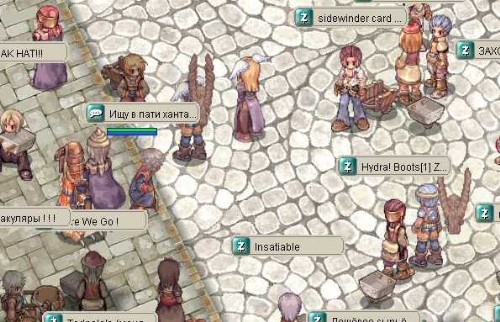

... то есть <<вселенцы>>[^1] всех регионов – объединяйтесь. А вообще-то я хотел сказать, что понял о чем ведет речь Лесси в своих дневниках. К сожалению, а может быть и к счастью, таких жителей на Вобле очень мало. Мне пока еще не удалось выявить ни одного из таких персонажей. Разве что Мария из гостевой книги – похоже она попала на Воблу с Луны, а так вроде бы все отражают свое "я" из реального мира в большей или меньшей степени.

Ой блин, вчера, кто бы мог подумать что я еще способен так увлечься развлечениями подобного рода, я все воскресенье посвятил игре Ragnarok, играя на русском бесплатном сервере этой игры [Mirror of the Realm](https://motr-online.com) (см. скриншот). Сказочная страна, нереальный мир – но так увлекает, что уходишь в него с головой, забывая все проблемы и нерешенные задачи из реальности.

Вчера весь день накручивал своего мага по [методике](http://motr.ru/f/viewtopic.php?t=3301) описанной на форуме игры. За это время успел создать команду с одним из начинающих магов, чтобы в будущем ходить вместе на монстров. Пока прокачивал героя, во время передышки, увидел пробегающую мимо героиню с эмблемой бразильского флага, завел разговор и выяснил, что девушка действительно из Бразилии. Рассказал ей о том, как мечтаю снова поехать в Бразилию, о том, что у меня много классных бразильских друзей. Выложил ей весь свой словарный запас португальского, который знал, включая фразу "восэ э маравилёза" (не знаю как это пишется по-португальски), после чего девушка, которую судя по нику звать Лилит, растаяла и даже пригласила встретися на следующем карнавале. Бедная Лилит, она даже не представляет, что Линкс не бросает на ветер подобные приглашения и обычно склонен выполнять свои обещания, нежели забывать о них.

Да, определенно, поверхностные знания английского языка дают неоспоримые преимущества при общении с иностранцами на этом сервере. Ближе к ночи, встретил канадца, который сначала клянчил у меня деньги, а потом стал выспрашивать информацию о том, чем кормить его любимого питомца Drop, после чего похвалил мои знания игры и предложил стать друзьями. "Почему бы и нет?" – был мой ответ. После чего он сказал, что вынужден бежать, выразил надежду на будущие встречи и испарился.

Между тем наш разговор с Лилит плавно перетек с темы о нашей общей любви к рок-музыке, моим позитивным и ее крайне негативным отношением к бразильским мотивам, к вопросам более житейским, про учебу/работу, про возраст, место жительства и пр. "А у тебя есть вэб-камера?" – вдруг спрашивает меня бразильянка. На что я вынужден был покачать головой и сказать, нет, так как не вижу в этом необходимости. "Впрочем, как обстоят дела с вэб-камерой у тебя?" – спросил я ее. "Нет денег, чтобы купить," – был ответ юной жительницы Бразилии. После того как я заметил, что мы находимся в совершенно противоположных ситуациях – у нее нет денег, чтобы купить вэб-камеру, у меня же они есть, но нет хорошей причиный идти на эту покупку, гениальная идея пришла в голову Лилит: "а знаешь, что, купи мне вэб-камеру :)," – придложила она... Почему бы и нет, подумал я и сказал, что для этого мне потребуется ссылка на какой-нибудь онлайн магазин в Сан-Пауло и ее домашний адрес, тогда у нее есть все шансы получить вэб-камеру в подарок. "...может быть," – добавил я и подмигнул. То ли эта последняя фраза ее смутила, то ли она испугалась, что я и вправду могу купить ей вэб-камеру, но она отказалась. "Как пожелаешь, заметьте, это была не моя идея," – прокоментировал ее ответ ваш покорный слуга Линкс. После чего мы еще немножко поболтали и я вынужден был ретировать, сказав что 3 часа ночи – это уже слишком и завтра на работу.

Ой, что-то я увлекся, а чем все начиналось-то? А, да, по поводу <<вселенцев>>[^1], я хотел сказать, что на Вобле пока еще не так много людей взялись за примерку на себя новых ролей, которые они хотели бы, но, по объективным или субъективным причинам, не могут играть в реальной жизни. Не все еще поняли, а те кто поняли не приняли того, что Вобла предоставляет возможность играть любую роль и оставаться при этом инкогнито для всех остальных, можно вытворять все, что душе угодно, лишь бы это укладывалось в рамки разумного с точки зрения администратора ресурса. А сама wobla.ru уже показала, насколько она толерантно относится к своим жителям и их поведению. Она – Вобла – даже отстаивает и защищает интересы тех воблянцев, кто имел неосторожность нецензурно высказываться в адрес таких акул вологодского интернета как Телеграф. (LOL)
_______________________________
[^1]: [<<вселенец>>](https://wobla.ru/blog/Lessi/848.aspx) – термин, впервые озвученный на этом сервере жительницей нашего городка – Лесси, ей же и принадлежат все права на использование и копирование термина в рамках этого сервера.

Оригинал: [https://wobla.ru/blog/idle_lynx/853.aspx](https://wobla.ru/blog/idle_lynx/853.aspx)
