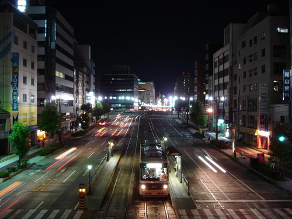
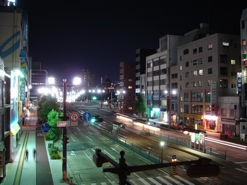

Не, я, конечно, зря гоню на свой фотоаппарат, он более чем успешно справляется с функциями, для которых предназначен. И даже больше, он позволяет получать неплохие снимки в таких условиях, в которых и не предполагается пользоваться такими простыми устройствами. Впрочем, его огромное достоинство перед профессиональными устройствами - компактность, не в ущерб скорости. Если честно, то я им полностью доволен. Но, как всегда, хочется большего :)

При желании можно получить неплохие снимки даже ночью. В качестве примера: другая ночь - ночь в Японии. Хиросима, август 2004 г.

Немного другой ракурс и длиннее выдержка. Эх, ведь можно же, если очень постараться (и выбрать правильное освещение :))

Как ни крути, ночь - мистическое и красивое время суток..

Оригинал: [https://wobla.ru/blog/idle_lynx/2054.aspx](https://wobla.ru/blog/idle_lynx/2054.aspx)
