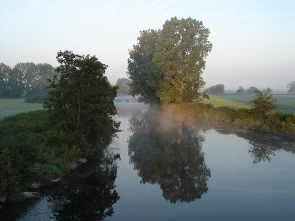

Заиграло радио будильника, протянув руку, отработанным движением выключаю хитрый механизм на автомате. Минута тишины и покоя.

Мелодично заиграл телефон - перенасторенный вчера будильник, выключаю, сквось сон (не помню о чем) думаю, что нежится можно не более 5 мин. а потом надо вставать.

Заиграл телефон... блин! я ж тебя выключал? Звонит шеф:
- Извини я опоздаю на 5 мин. - проспал
- Все нормально, - бодрым голосом отвечаю я и поднимаюсь.

Темнота, 6:05, не, вставать до рассвета - это преступление, ночь, да и утро в общем-то тоже придумано для того чтобы спать.

Но сегодня нужно было подняться до рассвета, так как мы договорились устроить фотосессию и фотографировать восход солнца. Ну если быть точным, то договорились мой шеф и еще один коллега по работе, а меня, так как я не фанат а лишь немного интересующийся, на подхвате взяли. И все же вставать в такую рань - это сумасшедствие, хотя ощущения прикольные.

6:11 выхожу на улицу. бррр.. не май месяц!

6:15 подъезжает шеф, точен, как швейцарские часы, хоть и швед

Заехали за другим коллегой - вот мы и в сборе. Двинули на позицию: склон не высокой горы с которого открывается неплохой вид на долину, где протекает река. Путь реки четко отслеживался по пластам густого тумана неподвижно лежащего вдоль ее поймы. Для контраста пространство над зелеными лугами было заполнено жиденькой дымкой. Небо на востоке уже налилось красным багрянцем, а на западе приобрело его чернота начала приобретать темно-синие и фиолетовые оттенки.

Коллеги зали, зачем они приехали, развернули штативы закрепили аппараты, и занялись съемкой. Морозно. Но красиво. Я лишь мельком наблюдал за их действиями, даже не пытаясь вникнуть в их негромкую беседу о выдержке, диафрагме, экспозиции, светофильтрах, балансе белого. Красивое предрассветное небо и удивительный ландшафт захватили мое внимание лишь на несколько мгновений. Вырванный из объятий сна, мерзнущий под утренним ветром на морозном воздухе, я чувствовал себя, как сонная замерзшая муха, никакого интереса, никаких желаний.

Им видимо надоело пялится на один и тот же пейзаж и они решили сменить позицию, я не возражал. Поехали на другое место, расположенное в долине, то, что мы присмотрели сверху.

На новом месте было немногим интереснее, немного скучноватый пейзаж и железная дорога. Небо посветлело, хотя солнце еще не выглянуло из-за гор. Здесь я уже присоединился к ним и, достав свой фотоаппарат, выбрал в качестве объекта фотосъемки своих коллег, снимающих восход.

Сделав несколько фотографий, решаем сменить позицию во второй раз. Пока ехали к новому месту, яркие лучи солнца ударили нам в спину. Хех, восход мы уже пропустили. Однако новое место было намного интереснее 2-х предыдущих. Фотоаппараты на штативы и вперед, я попеременно фотографировал то коллег, фотографирующих пейзаж, то пейзаж который они фотографировали. Солнце уже поднялось и достаточно ярко освещало окресности, так что штатив, которого у меня не было, по большей части был не нужен.

Дофига нафотографировались и поехали на работу.

9:05 рабочий день только что начался, но казалось, что прошел уже целый день насыщенный интересным событием. Тем не менее работа есть работа.

16:30 я почти закончил работу над очередной частью проекта, продумывал планы как все это дело прикрутить к рабочей версии и успею ли хоть что-нибудь запустить до 6, так как задерживаться не намеревался - тренировка по волейболу. Но не тут-то было..

Руководитель проекта:
- Ты не мог бы перенести проект на тестовый сервер, сколько это обычно занимает времени?
- (усмешка) Теоретически полчаса - час, но..
- Тогда переноси.
- Но.. на практике такое удавалось только пару раз, обычно этот процесс занимает полдня.
- Ты же говорил, что у тебя отработаная процедура.
- Да..
- Устанавливай.
- Хорошо.

Чуяло мое сердце, хотя логически все выглядело элементарным, тем более что все ошибки уже изветны, способы их устранения проработаны. И понеслась. 15 мин. и новый проект размещен на тестовом сервере.

Блин!!! Только что до меня дошло, что я собственными руками убил часть программы над которой работал :( "Ладно, фиг с ним, сейчас проверю, что тестовый сервер работает и верну ту часть кода, который только что убил," - оптимистично подумал я.

Запускаю, проверяю, все пашет, но на одной из страниц валится ошибка, ыыыы. Так и знал! Кофе. Размещаем на сервере для разработки - работает. Парадокс! Возвращаемся к тестовому, там старая версия сервера, надо бы обновить. Еще кофе. Качаем обновление, смотрю на часы... нда... С кофе пора завязывать. Тут выясняется, что в конфигурации проекта были важные изменения. Ну елки! Почему мне сразу не сказали. Забиваю на обновление, говорю, что уверен, что проблема именно в этой конфигурации, обещаю обновить завтра. Смотрю на часы. Может еще успею.. Еще 20 мин. Проект установлен, работает. Не тут то было:
- Погоди, надо проверить, работают новые изменения или нет.
- Хорошо.

Вроде как и работают, но вылезла ошибка. Давай проверим на рабочем сервере. Ыыыыы. Хорошо. Там все работает. На тестовом - снова ошибка, а вот так работает. Объясняю почему. Говорят: "нет, такого не может быть". Проверяем. Я прав. Но.. Блин. Н-да. Мне уже все равно.

- Ты вроде хотел чтобы тебя подбросили?
- Мне уже все равно, могу на поезде.
- Ну как хочешь.
- То-есть, я хотел сказать, большое спасибо, было бы неплохо если бы меня подбросили, но я могу и на поезде, так как спешить больше не куда.

Да... на тренировку я определенно уже опоздал.

20:15 вроде как и спать еще рано, и делать нечего, тренировку пропустил, голова гудит от загруза и, возможно, от усталости, а и нефиг! не будем о грустном!

Во, лучше выложу фотку, из утренних:

Оригинал: [https://wobla.ru/blog/idle_lynx/2071.aspx](https://wobla.ru/blog/idle_lynx/2071.aspx)
