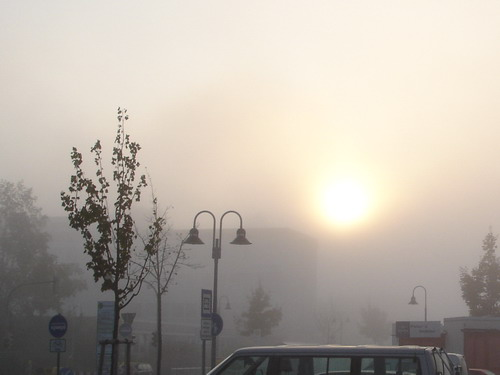

Весь день сегодня пыхтел. Впрочем особо не напрягался, в последнее время мне довольно неплохо работается, голова свободна от посторонних мыслей, удалось добиться своего рода отрешенности от несвязанных с работой проблем и научиться концентрировать свое внимание на работе. Методы, конечно, были радикальными, зато действенными.

Но речь будет не об этом. В конце дня подходит шеф задать свой любимый вопрос, в надежде услышать после моей тирады воспевания гениальности меня самого, моих советов, моей работы и вообще всего, к чему я прикасаюсь, утвердительный ответ.

- Ну как продвигается работа? - спрашивает шеф.
- Хреново, - лакончно отвечаю я не отрываясь от клавиатуры.
- ... (явное недоумение)
- ... (полная отрешенность и немного виноватого смущения)
- Ок.
- ...
- Так-то мы планировали закончить к среде, - говорит шеф, но я то помню, что я хвастливо обещал, что в понедельник все уже будет работать.
- Будет сделано, - бодрым голосом, не моргнув глазом отвечаю я.
- Ок.

Эх, да.. а что делать, нда, завтра точно все доделаю, сегодня уже протестировал, частично работает. Но все равно.. фигня получается.

* * *

Что-то меня прёт последнее время фотографии выкладывать, надеюсь, что читателей воблы это не напрягает. Вот такие туманы бывают у нас по утрам (фотка с прошлой пятницы, порезанная):

Оригинал: [https://wobla.ru/blog/idle_lynx/2081.aspx](https://wobla.ru/blog/idle_lynx/2081.aspx)
