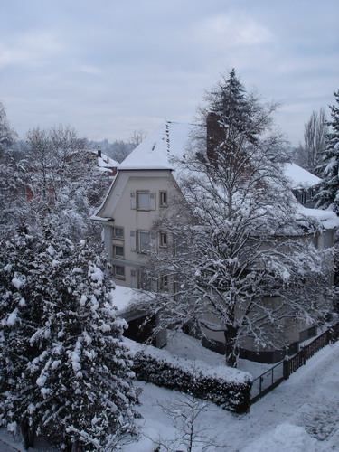

Декабрь прошлого года (21-е), накануне, а также всю ночь валил снег, мягкими и крупными хлопьями, как он любил это делать в Карелии. Но в этих краях такой снег даже в конце декабря - редкость. Обычно присыпит жиденько асфальт и каменные мостовые и растает через день-другой. Хотя местные жители и говорили, что наши края считаются снежными, верилось в это с трудом, прошлый год был первым по настоящему снежным годом для меня.

Тогда я безумно радовался, что наконец-таки Новый Год ну и Рождество мы будем встречать по настоящему, по-рождественски, со снегом. Водители же автомобилей, которых здесь намного больше, чем таких как я - добирающихся на работу на общественном транспорте - скорее всего проклинали небеса за то, что те спослали им такой "подарочек" под Рождество.

Не знаю каким чудом я захватил фотоаппарат с собой, тогда у меня еще не было привычки таскать его везде куда бы я не отправился, возможно я собирался навестить Воблу, а может еще по какой причине, но увидев такую красотищу за окном я просто не мог сдержаться и не запечатлеть это на пленке (то есть на матрице фотодиодов):

В тот момент никаких хитрых идей о создании серии фотографий одного и того же объекта еще не было, просто хотлеось оставить на память изображение домика покрытого снегом как доказательство того, что и сюда иногда заглядывает зима и наряжает город в белые одежды.

Хм... начинаю припоминать, почему я захватил фотоаппарат: по ностальгической просьбе Воблы я делал фотографии нашего городка в канун Рождества, кода десятки ёлок выставлены вдоль обеих сторон одной из главных улиц города и наряжены в простенькие гирлянды. Ничего сложного, но смотриться вполне симпатично, особенно вечером, когда горят одноцветные желтые фонарики гирлянд.

Тем не менее, уже тогда меня начала грызть мысль о том, что вроде бы где-то у меня завалялась летняя фотография этого чудо-домика. Перерыв все свои архивы я так и не нашел ее и в общем-то решил не забивать голову выдуманной проблемой, а заняться работой. Как-никак этот чудесный вид - вид из окна моего рабочего кабинета.

В следующей серии: снежная сказка

Оригинал: [https://wobla.ru/blog/idle_lynx/2244.aspx](https://wobla.ru/blog/idle_lynx/2244.aspx)
