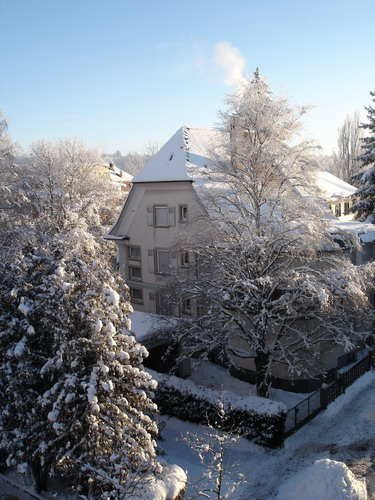

"Мороз и солнце, день чудесный..." (с) Саня Пушкин

Тот день был именно таким, канун рождества 22-е декабря прошлого года, буквально на следующий же день после того, как я избрал этот несчастный домик объектом пристального наблюдения для объектива моего скромного фотоаппарата.

Можно долго и нудно описывать красоту заснеженных деревьев и построек в ярких лучах полуденного солнца, можно описать это одной строчкой, а можно просто сфотографировать, в тот день я выбрал последнее ^_^

Это лучшая зимняя фотография и одна из лучших во всей коллекции. Но, как говориться, лучше один раз увидеть, чем 100 раз услышать:

В следующей серии: ранняя весна

Оригинал: [https://wobla.ru/blog/idle_lynx/2259.aspx](https://wobla.ru/blog/idle_lynx/2259.aspx)
