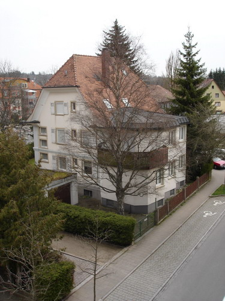
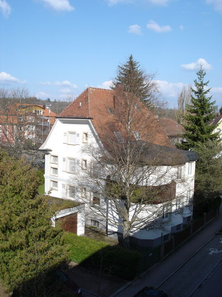

Такими темпами к Новому Году доберусь до летних фотографий, с морем солнца и зелени, пока же немного мрачноватый пейзаж ранней весны (13-е апреля):

Голые ветки деревьев, пасмурная погода, пустые улицы, пронизывющий ветер но все же весна.

Весна приходит в наши края рано, очень рано по карельским меркам, да и по вологодским меркам тоже. Уже в середине февраля снег полностью исчезает, оставляя за собой скучный пейзаж голых ветвей деревьев. Как ни странно, трава и и многие кусты здесь вообще не желтеют, из под снега выглядывает темно-зелеными стеблями, а как только сходит снег, они уже готовы к встрече весны.

Ну положим с кустарниками все понятно, выбирается какой-нибудь тропический тип кустарника и используется для создания зеленой изгороди, но вот трава.. Впрочем, в черте города во многих местах и трава засаживается специальными командами, перекапывается, удобряется и окучивается регулярно каждой весной.

Деревья не настолько динамичны, не способны так быстро адаптироваться к изменениям погодных условий или просто они нормального (не тропического) типа, и поэтому начинаются расспускать почки и покрываться ярко-зеленой зеленью лишь в конце апреля, начале мая, но не буду забегать вперед.

Вот такой вот скучноватый пейзаж и приходится наблюдать почти 3 месяца: с февраля до начала мая. Однако большую роль в данном случае играет освещение, вот так, например, преображается тот же самый пейзаж с приходом закатного солнышка (21-е апреля):

В следующей серии: весна! настоящая!
