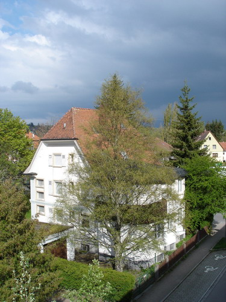

"Люблю грозу в начале мая..."

Пока улицу посыпает предновогодний снежок, можно предаться воспоминаниям о всесне :) Удивительно, как в течении недели вся природа вокруг преображается, почки расспускаются в течении пары дней и бушующая зелень заливает ветви деревьев. А ведь казалось бы чего и сделали: так, добавили немного зелени, солнышка и грозовых темных туч.

Солнце палило с самого утра, низкие тучи пригнанные ветром не оставляли никаких сомнения в намерениях Зевса, природа замерла в ожидании светопредставления и лишь солнышко беззаветно и ярко освещало окрестности (10 мая):

В тот вечер гроза так и не разродилась, а прогремела она ночью когда все уже спали включая меня. Последние отголоски грома прогремери с утра еще до моего будильника и были успешно мною забыты ;)

На следующий же день снова ярко светило солнце освещая умытую листву деревьев и кустарников.

В следующей серии: хмм... лето... ммм... нет, пожалуй, день после грозы ^_^

Оригинал: [https://wobla.ru/blog/idle_lynx/2292.aspx](https://wobla.ru/blog/idle_lynx/2292.aspx)
