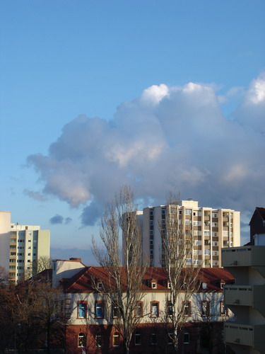

"А из нашего окна Площадь Красная видна.."

В прошлые выходные гостил у Воблыча, отмечали местное Рождество, смаковали подаренный Оле коньяк, наслаждались дополнительным выходным.

И вот гляжу я в окошко на кухне, а там пролетарского вида такой вот пейзаж, чем он меня и покорил:

Сразу почему-то вспомнился Маяковский, хотя ни одного стихотворения из его сочинений на ум не пришло.

Да, тепло все-таки Воблыч устроился, пейзаж из окна на кухне опять таки душевный, а у нас, на юге, в горах Шварцвальда - снег, морозец, зябко.
