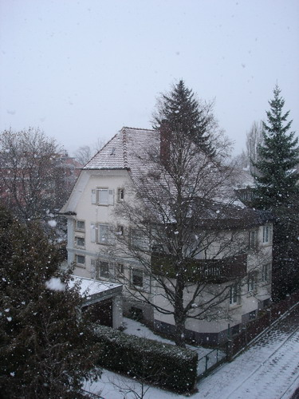

По настоятельной просьбе Лесси вместо обещанной в прошлый раз "почти летней" фотографии выкладываю изображение совершенно противоположного сезона.

Вот такой вот сногопадик. Я даже маленький видо-файл записал, уж больно красиво смотрелся этот процесс в динамике. Это, конечно, не вьюга с пургой и не снежная буря, но безшумный процесс падения легких хлопьев снега тоже завораживает:

В следующей серии: почти лето

Оригинал: [https://wobla.ru/blog/idle_lynx/2313.aspx](https://wobla.ru/blog/idle_lynx/2313.aspx)
