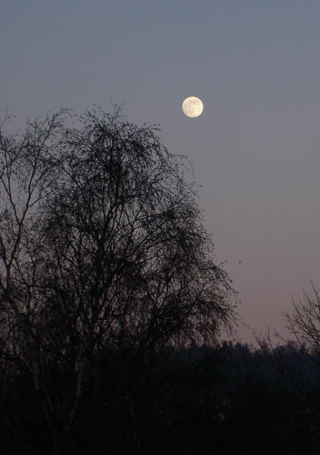

В пятницу 13-го, дело было вечером, делать было нечего. Полная луна протянула серебристую дорожку света по поверхности моего рабочего стола, но в районе клавиатуры проигрывала свои позиции яркому освещению задней подсветки монитора. Покончив с проблемой, с которой бился в течении нескольких часов, я откинулся на спинку стула. Мой взгляд упал на это небесное создание: "Надо запечатлеть," - подумал я и потянулся за фотоаппаратом.

Сегодня настроение схожее с тем, что у Лесси, впрочем, приписав в MSN мессенджере: "doesn't give a damn" решил, что все - фигня по сравнению с мировой революцией и выбросил любые размышления о смысле бытия куда подальше.

Как там Алукард (Hellsing) говорил: какая сегодня восхитительная луна мисс Виктория!
