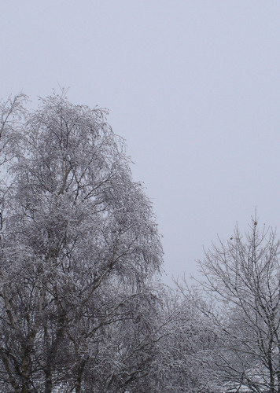

Блин, ну надо было так, накануне отпуска подвернуть себе ногу на тренировке, на последних минутах, ну нафига мне это надо?

Вообще прикольно получилось приземлился сразу понял: дело дрянь. Взвыл для приличия и похромал в сторону умывалки, сунул ступню под струю холодной воды, хотя хотелось ледяной. В это время кто-то сбегал за снегом, и тут меня шибануло в пот, глаза затуманились, со мной говорят, я невнятно объясняюсь, блин тут такая ситуация а меня чего-то на немецком спрашивают, пробормотал что-то в ответ, а сам интенсивно снабжаю легкие кислородом. Завалился на скамейку, лежу, снег приложил, дышу.

Через несколько минут начинаю приходить в себя, хотя пот все еще льет градом, снег убрал, натянул носок, вроде полегчало, глянул в зеркало: мама-мия, бледный как рыба об лед.

Еще через пару минут совсем очухался, даже порозовел, подбросили до дома, перевязал лодыжку, чувствую себя как человек. Даже перемещаться могу почти не хромая.

Вот думаю: блин, нафига мне это было надо накануне поездки? ыыыы... ладно, прорвемся, уже вроде ничего, сижу, жую пицу, радуюсь жизни и тому что на этот раз более здоровой ноге не повезло, левая точно заартачилась бы, ей уже столько перепадало.

Ладненько, лучше о хорошем, о зиме :))) вот такую фотографию мне удалось сделать недавно одним морозным утром:

Эх, скоро в отпуск, на следующей неделе, если будет возможность, отмечусь из Сервеной Ирландии ;)

Оригинал: [https://wobla.ru/blog/idle_lynx/2353.aspx](https://wobla.ru/blog/idle_lynx/2353.aspx)
