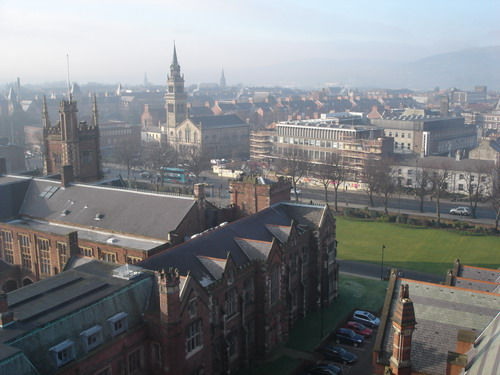
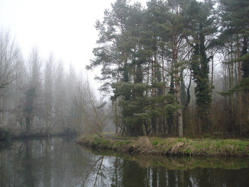
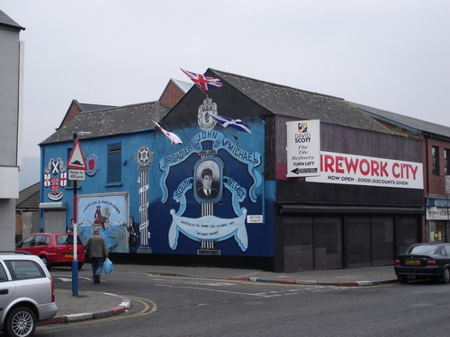
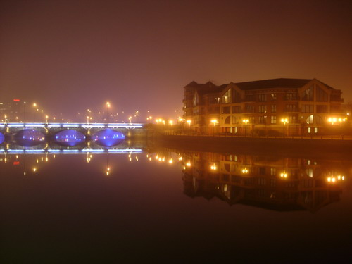
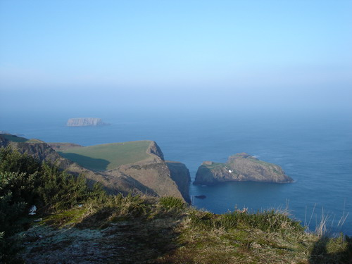
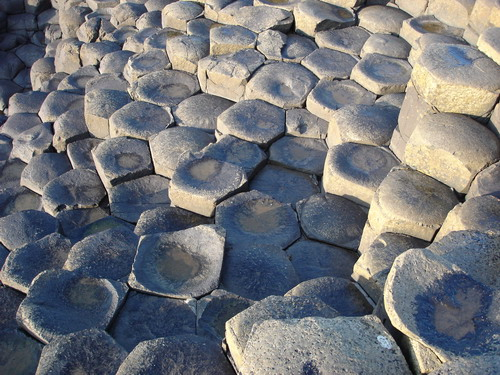
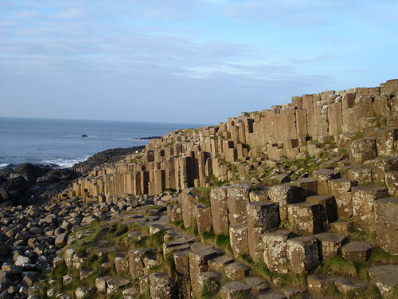
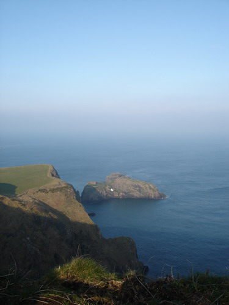
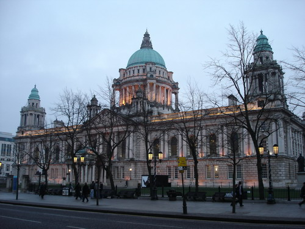
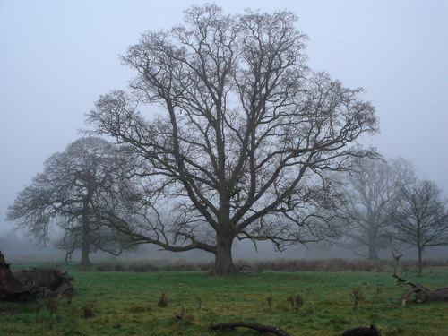

Город отмечал мой приезд густым туманом. Не то, чтобы его особенно волновал мой приезд, но так уж повелось, что Белфаст (а это единственный населенный пункт в Северной Ирландии, претендующий на статус города) встречает всех путешественников затяжными туманами. Каждое утро солнце пряталось за густыми прослойками дымки и 4 из 7 проведенных там дней эта дымка держалась с утра до поздней ночи. Было зябко, но на удивление тепло. Несмотря на то, что Ирландия и зовется северной, в это время года там намного теплее чем на юге Германии.

В этой маленькой стране, лежащей в стороне от основных торговых путей, рождаются живут и передаются из поколения в поколение легенды о сказочных существах, тролях, гномах, духах леса и прочей нечисти. Удивительные прибрежные ландшафты и мистические лесные пейзажи близлежащих парков создают удивительную атмосферу таинственного, как будто попадаешь в средневековую сказку. Здесь принято при сдаче в наем дома или комнаты помимо цены и наличия комунальных услуг рассказывать постояльцам о том, что дом не населен привидениями или, например, сказать, что да, в доме живет семейный дух, но он очень миролюбивое создание и не доставляет особых хлопот, если его не тревожить.

Цент Белфаста выглядит именно таким как я предсталял себе средних размеров город в Англии: приземистые кирпичные дома характерной архитектуры, католическая церковь или храм через каждые квартал по обе стороны дороги. Вообще религия здесь один из силных политических рычагов. В свое время религиозные деятели поддерживали группировки, принимающие активное участие в вооруженных конфликтах против сил полиции и британских вооруженных сил.

Совсем недавно Белфаст был местом проведения военных операций: слишком много радикально настроенных сил, с противоположными политическими взглядами, которые получили поддержку масс и доступ к вооружению и амуниции. Центр города был разрушен несколько раз, поэтому красуется молодыми кирпичными застройками. Сложилось такое впечатление, что неокрашенные здания из красного и желтого кирпича – любимый архитектурный стиль местных жителей. Возможно это традиция сложилась ввиду продолжительных боевых действий, когда вновь отстроенные здания не успевали отштукатурить и покарасить, как были уже разрушены очередным взрывом.

Сейчас Белфаст выглядит вполне мирным и приветливым городом размером с Вологду. Люди решили, что есть более приятные способы времяпровождения. Например, випить кружку другую пива Гиннесс в одном из баров, которых здесь еще больше, чем церквей. Кстати, часть церквей и храмов были переоборудована под общественные нужды. Так в самом центре города, в здании храма, где когда-то люди слушали проповедников и отправляли свои просьбы всевышнему, сейчас размещается один из крупных супермаркетов города. В церкви, напротив Королевского Университета Белфаста, нашел свой приют небольшой театр.

О да, возвращаясь к вопросу о пиве :) Пиво здесь совсем никакое, по сравнению с тем, к которому я привык. Никакое за исключением одного особого сорта – Гиннесс (Guinness). Если кому-то доведется побывать в Ирландии, обязательно отведайте этот напиток. Будьте готовы к напитку горьковатого вкуса черного кофе с явным присутствием алкаголя и густой устойчивой кремовидной пеной. "Гадость," – подумал я, когда впервые пробовал этот напиток в нашем Ирландском баре. Когда мне довелось отведать этот напиток повторно, я нашел его интересным и достойным внимания. Но когда я попробовал Гиннесс в Белфасте, я понял, что этот напиток действительно был создан профессионалами своего дела.

К полуночи центр города вымирает, улицы совершенно пустые, никто не гуляет по просторным мостовым, шумные бары, в которых проводят свои вечера ирландцы располагаются в стороне от свежеотстроенного центра, никто не выходит полюбоваться белоснежным дворцом городского управления, ни единой души на удивительно красивой набережной, освещенной мягким светом фонарей и подсветкой рассеянными естественным светофильтром тумана.

Не Белфастом единым жива Северная Ирландия. Красивые картины открываются на побережье Ирландского моря к северу от столицы.

Одна из самых знаменитых достопримечательностей Ирландии – гигантская мостовая (Giant Causeway). Удивительное наргомождение камней естественного происхождения в форме почти правильных шестиугольных колонн. Легенда говорит, что это отсатки разрушенного моста между Шотландией и Ирландией возведенного гигантом, который, по словам нашего шофера-гида, пришел навестить ирландскую любовницу. Далее следует запутанная история о муже и в итоге гигант в страхе убегает на зад в Шотландию, и под тяжелой поступью его бега мост рушится. Вот так выглядят его остатки:

Вообще шофер нам попался прикольный. Всю дорогу рассказывал анекдоты и прикалывался над всеми другими национальностями. "Знаете," – говорит, – "почему у ирландцев такие тупые шутки? Это чтобы британцы могли их понять." Это один из самых слабых его подколов. Сказал, что мы можем не стесняться и задавать ему любые вопросы, если он не знает ответа на вопрос, то он просто придумает что-нибудь правдоподобное.

Когда мы подъезжали к другой достопримечательности Северной Ирландии – длинному веревочному мосту, перекинутому на близлежащий остров, шофер сказал, что к сожалению мы не сможете сегодня пройтись по нему. Первая версия, объясняющая причину этой печальной новости, звучала так: "В прошлую субботу во время теракта взрывом бомбы били разрушены 3 из 4 пролетов моста." Потом он сказал, что можно конечно сказать своим друзьям, которые будут спрашивать про этот мост, настощую причину: мост снимается на зимний период, но первая версия объяснения звучит намного круче.

Как прописал врач и рекомендовала Лесси первые 3 дня я ходил в бандаже, снимая ее только на ночь. Но после путешествия к побережью у меня вдруг ни с того ни с сего заболела коленка, причем на следующий день коленка ныла настолько сильно, что я уже хромал не из-за растянутой лодыжки, а из-за ноющей коленки. Я решил что с меня хватит бандажи, и снял бандажу, но хромать не перестал. Зато, ходить стало легче и постепенно боль в коленке утихла до уровня терпимого, хотя я так и прохромал до последнего дня. Сейчас уже все совсем нормально, могу даже наверное прыгать, если осторожно.

Помимо распития Гиннесса в барах есть у ирландцев и другие развлечения. Так в пятницу накануне отлета я был свидетелем матча по хоккею между Белфастскими Гигантами (Belfast Giants) и Шотландской командой. Команда Белфаста, на мой непрофессиональный взгляд, – слабаки, череповецкий Северсталь разнес бы их в пух и прах, поэтому я болел за наших – за шотландцев. Те, к сожалению, оказались еще хуже и проиграли со счетом 1:3 Белфастским Гигантам. Полное фиаско. Я решил, что ни те ни другие не умеют играть в хоккей и заявил, что Россия – чемпион. Впрочем представление было зрелищным хотя и скучным – ни одной драки после матча :)

Вот кратенько и в картинках о том, каким я увидел Белфаст и Северную Ирландию в целом.

А леса в округе Белфаста насковзь пропитаны мистикой и магией.

А да, чуть не забыл: левостороннее движение действительно напрягает.

Оригинал: [https://wobla.ru/blog/idle_lynx/2373.aspx](https://wobla.ru/blog/idle_lynx/2373.aspx)
