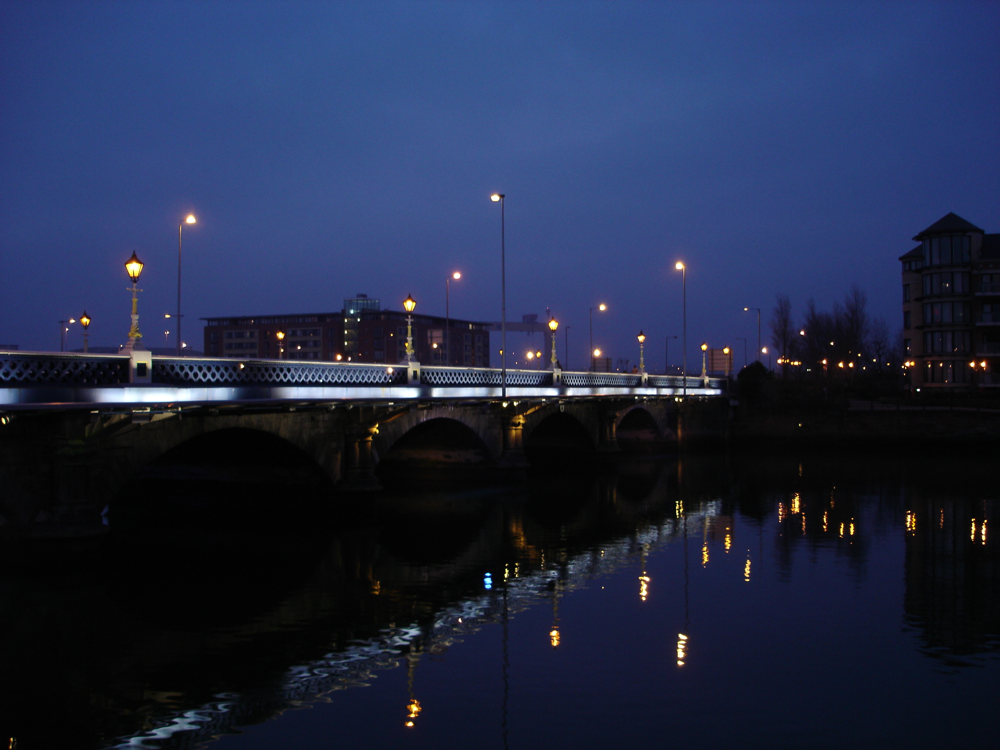
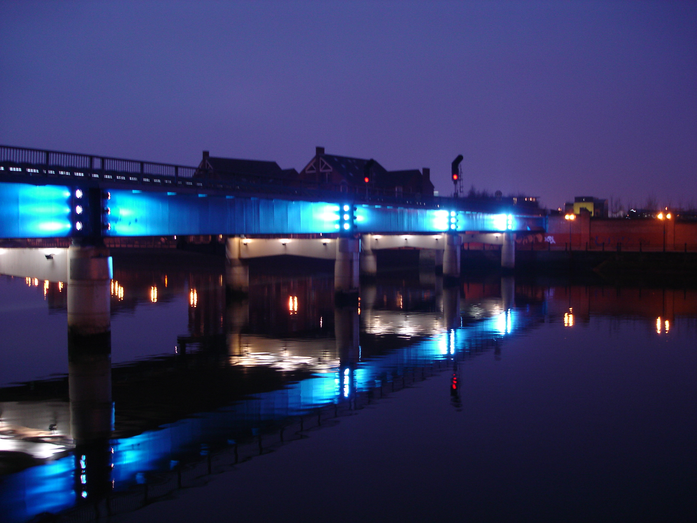
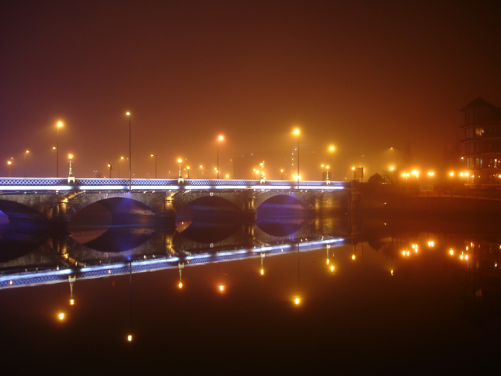
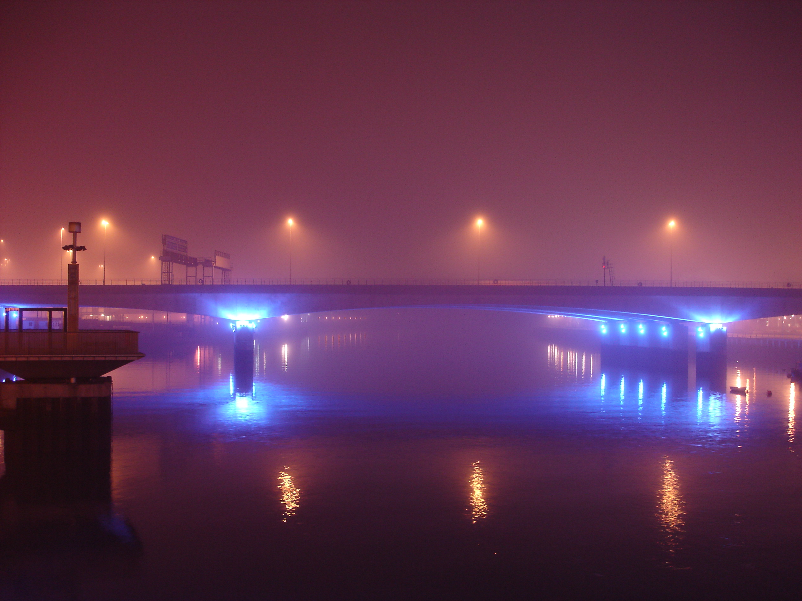
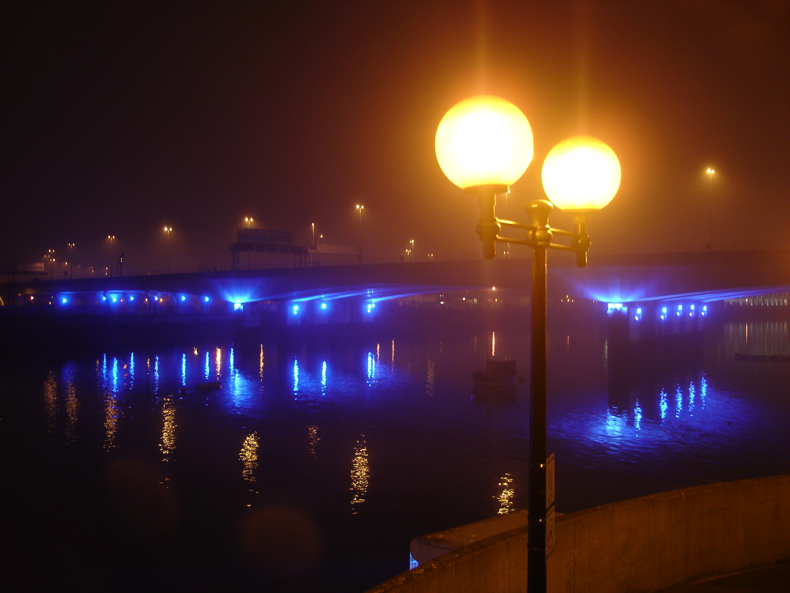
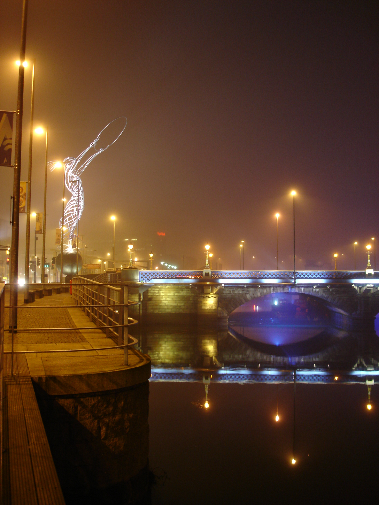

уф... Устал. С самого полудня до позднего вечера восстанавливали CVS репозиторий. Коллега по работе, по чьей причине и была заварена вся эта каша, сидела вся на нервах. Удалить историю половыны исходников, когда не сегодня-завтра может потребоваться предыдущая версия. Хе-хе, ну ей повезло, я хладнокровно все расчитал, где надо удалил, все что надо восстановил. Хорошо все то, что хорошо заканчивается. Но, надо заметить, такие вещи достаточно утомительны, незаметно вытягивают энергию. Усталость почувствовал, лишь сейчас, когда добрался до дома.

Впрочем, речь будет не об этом. Сегодня, отправляя несколько фотографий по мылу, понял, что тема ночного Белфаста не была окончательно раскрыта в предыдущем рассказе про [Северную Ирландию](/2006/02/northen-ireland).

Поэтому сегодня я представляю на обозрение еще парочку фотографий набережной ночного Белфаста в необычную ночь:

а также в обычную очень туманную ночь:

Ну и вот это сооружение (то что сияет белым слева), постороеное в честь погибших при кораблекрушении Титаника. Как известно, Титаник, также как и Британика, был построен на верфях Белфаста:

