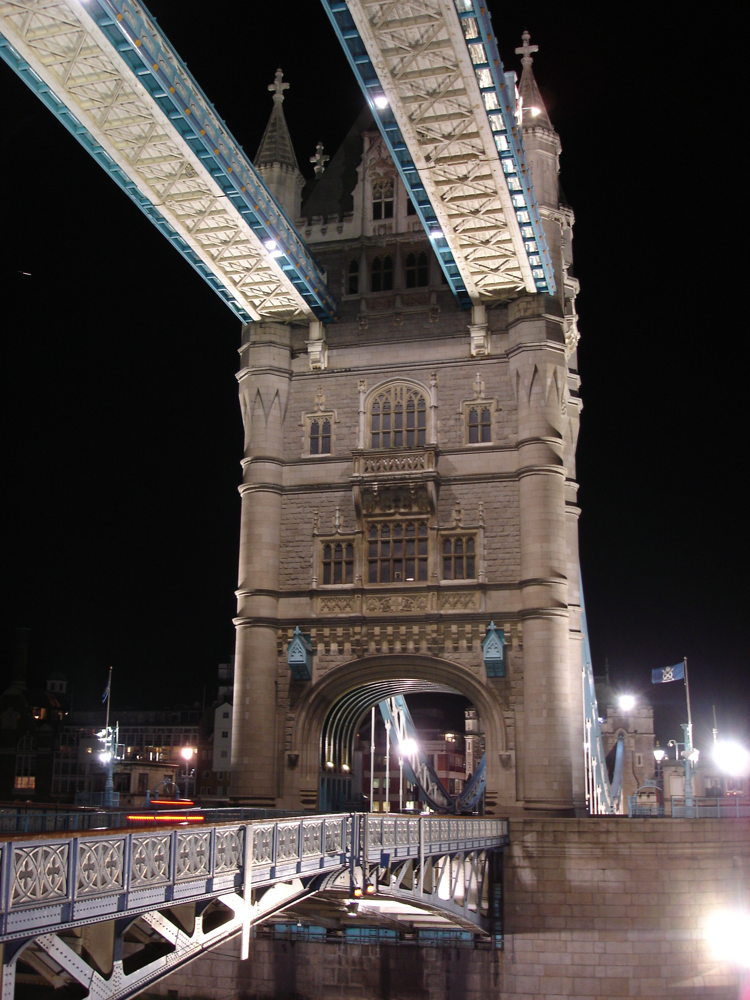
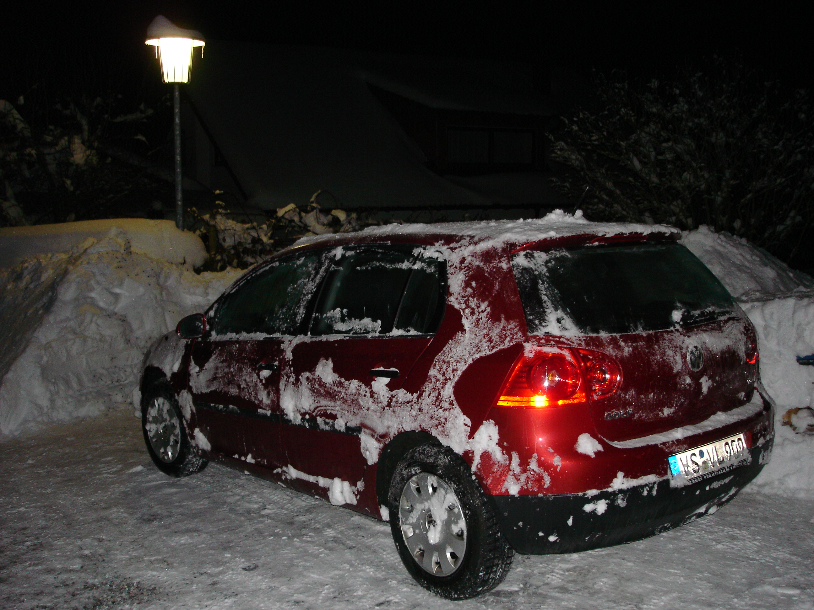

Хотелось бы очень много написать, рассказать об этом удивительном, интересном и безграничном городе, одном из древних центров европейской культуры, колыбели и одном из последних остовов монархии... тьфу ты блин, прямо как в путеводителе получается.

Короче, рассказывать мне особо не о чем :) потому как 5 из 6 дней, что мы провели там, мы торчали на задворках этого мегаполиса, недалеко от аэропорта Хитроу (Heathrow) - в получасе езды на автобусе в сторону какой-то всеми забытой деревеньки, единственной достопримечательность которой являлся расположенный там бизнес-парк - где проходили наши курсы по "повышению квалификации".

На курсах я убедился в том, что они нам в общем-то были и не нужны. Они лишь подтвердили, что последний год мы все делали правильно :) Как бы то ни было, лектор нам попался интересный, с хорошо поставленной дикцией, хотя натурально халявил - просто читал презентацию с экрана, добавляя парочку предложений от себя для связки между слайдами.

Задав ему несколько вопросов, я выяснил, что большинство его знаний чисто теоретические, поэтому перестал мучать его потенциально сложными вопросами, а просто усердно выполнял задания. Впрочем, для вежливости, иногда просил подтвердить его в полуутвердительно форме мои "чисто теоретические" (давно уже испытанные нами на практике) предположения.

Курсы, хоть и были по сути своей простыми, все же порядком вымотали меня - быть всегда первым было не просто, так как коллега по работе, была не менее чем я подкована практически. Но большинство заданий я выполнял быстрее, хе-хе.

Под конец недели я заметил, что если бы мы с такой же скоростью программировали в фирме, вместо того, чтобы ходить по комнатам, водить беседы с коллегами, пить чай и кофе и прочая, то наш проект, над которым мы работаем уже больше года, был бы готов в течении 2 месяцев.

В итоге, всю неделю с 9 утра и до 5 вечера мы сидели на курсах и [начало цикла]тупо долбили код, слушали чтение следующей главы презентации и брались за выполнение нового задания[конец цикла]. После этого, на автобусе ехали в гостиницу - полчаса, топали к станции метро и отправлялись к центру цивилизации этого британского острова.

Метро, которое в Лондоне зовется трубой (tube), вполне удобный, хотя и недешевый вид транспорта. Нам не повезло, наше место проживания было расположено на одной из конечных станций метро. А это значит больше часа, чтобы добраться до центра города: если повезет то 1.5 часа, если не повезет, то 2 и больше. Невезло нам 3 из 6-ти раз.

Итого, примерно в 8-м часу вечера мы имели счастье наслаждаться ночными видами города. Наслаждаться, правда мы могли не так уж и долго, так как дорога к гостиннице была не близкой, а труба закрывается вскоре после полуночи, но часа 3 все же получалось.

Ну ладно, хватит причитаний, лучше покажу в картинках как выглядит Лондон ночью в местах, часто посещаемых туристами. Некоторые из вечерних фотографий уже были ранее опубликованы в [предыдущей заметке](/2006/02/london).

Еще один вид на башню Биг Бэна (а что делать, действительно красивая штуковина):

Статуя на площади Пикадилли (Piccadilly Circus), говорят – знаменитая, вот я и сфотографировал на память, по-моему, неплохо получилась:

Следующий объект не менее знаменит чем Биг Бен. По крайней мере, когда в каком-то туристическом магазинчике я глянул на путеводитель по Лондону и увидел его на обложке. В мозгу сразу всплыло название, успешно забытое с еще школьных уроков по английскому языку. Это гигантский разводной Башенный (?) Мост – Tower Bridge. Какой же турист, пройдет мимо такой добычи, вот и я отправился к тому месту и, несмотря на холод и леденеющие и негнущиеся пальцы, запечатлел это удивительное создание рук битанских (а может и африканских – я не силен в истории Лондона):

Ну и при ближайшем рассмотрении разводной пролет моста выглядит вот так:

В другой день мы поехали кататься на колесе, которое расположено на берегу Темзы невдалеке от пресловутого Биг Бэна, вот так выглядит одна из попыток заполучить ночной вид Лондона с высоты птичьего полета (Биг Бэн где-то чуть правее):

Далее идет кибернетический сад:

Ну и в завершении цикла, вот такая вот композиция с фонтанами. Это возле площади со статуей на огромной колонне, окруженной 4-мя агромадными львами, простите мою географию :) (статуя как раз за спиной фотографа):

Ой, чуть не забыл, набросок: река Темза, мост, Биг Бен, луна, вампиры...

Вот такими ночными видами встретил и проводил нас Лондон.

А по возвращении назад нас ждал другой сюрприз: бастующие дворники и бастующая погода. До дому мы кое как все-таки добрались и всю субботу я отсиживался дома, лишь изредка с опаской поглядывая в окно на неперестающий с самого утра падающий снег. День проходил, а снег все валил и валил... валил и валил...

В воскресенье ранехонько, где-то после полудня, я решился таки выглянуть на улицу. "Фигасе!" – сказала бы Марси. Я же это выразил немного по другому и на другом языке. Мой сосед потом еще долго подсмеивался надо мной изображая выражение моего лица на тот момент и повторяя мои слова. Ему-то хорошо, его машины в гараже. А вот так выглядела моя машина на тот момент:

Я всерьез подумывал отправиться на поезде в понедельник на работу. Но потом решил, что "мы не ищем легких путей" и взялся за лопату. Через 20 мининут, не завершив и 4-й части работы, мне надоело ворочать снег. Ярко засветило солнышко. Кучи снега, солнце, удивительная погода. "Нет, определенно, такой день не должен пропадать зря," – подумал я и, прихватив фотоаппарат, отправился фотографировать наш городок. Получилось много синего неба, белого снега и темно-зеленых/черных ветвей деревьев. Что-то вроде такого:

Нагулявшись в доволь и успев замерзнуть я потопал домой, где меня ждало задание, которое обещало хорошенько меня разогреть – махание лопатой. Все же я это сделал, я отрыл ее, вот такой предстала моя машина уже ближе к ночи из под самого снега:

На этом я пожалуй закруглюсь, тем кто дочитал – пряник ^_^
