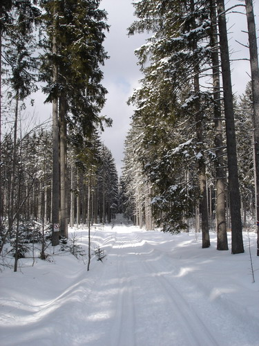
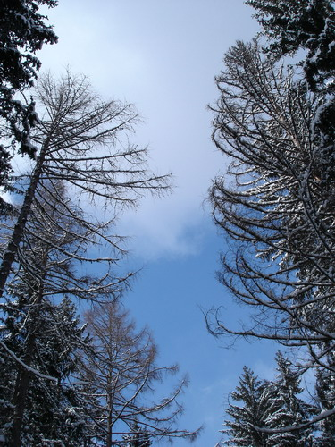
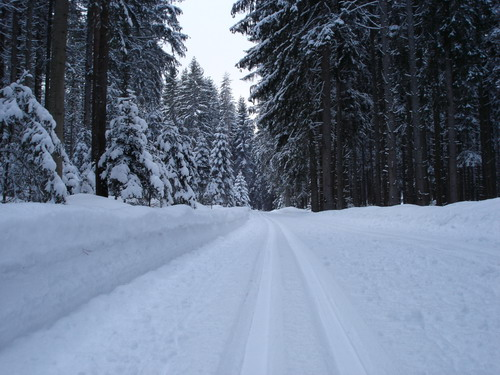
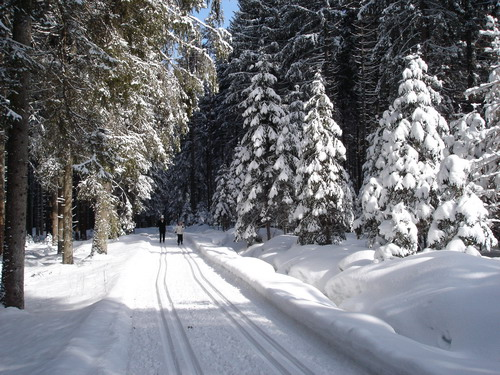

В продолжение истории с поездкой в Лондон, начальству показалось мало того, что нас отправили учиться тому, что мы и так уже знаем, оно решило, что надо бы, пока то что мы "выучили" не забылось, побыстренькому получить сертификаты.

По возвращению из Лондона, мы зарегистрировались на сайте и подписались на 2 теста. 1-й - на знание о фирме, их продуктах, маркетинговой политике и конкурентах. 2-й собственно тест для программистов, который представляет наибольший интерес и отражает "реальные знания и навыки" разработчика.

Для сдачи я усердно готовился в течении 3-х вечеров и 1 рабочего дня, прослушивая презентации различных менеджеров по маркетингу продуктов компании, которые вдохновленно рассказывали о достоинствах последних. Загрузился по полной, 2 последние презентации уже просто пролистал не слушая, потому как понял что не выдержу, голова потихоньку начала кружиться. На мое счасть в наушниках села батарейка и у меня нашелся хороший повод выключить звук.

Для сдачи тестов поехали в Цюрих, не из-за понтов :), а просто потому, что там работает наше начальство и еще один разработчик. Либо они к нам, либо мы к ним. 2:2. Решили, что мы поедем к ним, чтобы нам никто не мешал в тишине сдавать тесты :).

Ну, скажу я вам, такой халявы у меня даже в институте не было. 3 разработчика (2-е из которых усердно готовились, 3-й вообще ничего не учил) и 1 менеджер сдавали один за другим 1-й тест друг для дружки используя распечатку вопросов и ответов тех, кто уже сдавал этот тест для нас. Конечно же все из нас сдали первый тест с баллом 90% и выше.

Но впереди был второй тест - основной, тот который еще никто до нас не сдавал, поэтому мы перед его сдачей мы первым делом сходили на обед :) - подкрепиться и собраться с духом.

Вооружившись всевозможными материалам и приготовившись скринить вопросы для последующего анализа мы втроем (программисты) уселись за тест для того, кто вообще ничего не учил. Пока мы вдвоем соревновались, кто быстрее правильно ответит на вопрос, экзаменуемый лишь смотрел на вопросы и хлопал глазами. Итог 95%. Хе-хе - это было весело, опять же полная халява! :-О

Но хорошее на этом заканчивается, когда сели решать тест для меня, выяснилось, что что-то сломалось в моей регистрации на экзамен. Аналогичная проблема была у коллеги. Служба поддержки сайта - в США и в это время у них раннее утро от силы 5 утра. В общем уехали мы домой в тот день без сертификатов. Полное разочарование, после стольких усилий по подготовке ничего не вышло.

Голова гудела всю оставшуюся неделю. Сегодня получили подтверждение, что регистрацию починили и мы можем приступать к тесту, но коллега слвалила в отпуск на неделю, так что отдыхаю.

О, в позапрошлые выходные пригласили покататься на лыжах. Я конечно предпочитаю горные, но после вывиха не решался, а тут предложили просто побегать по лесу, подумал: "почему бы и нет", тем более что денек выдался замечательный:

Небо голубое с белоснежными облаками:

Лыжня отличная:

К чему я все это?... А, да! Здешние леса, особенно в такую снежную солнечную погоду, очень напоминают карельские. Ээээх...

Оригинал: [https://wobla.ru/blog/idle_lynx/2436.aspx](https://wobla.ru/blog/idle_lynx/2436.aspx)
