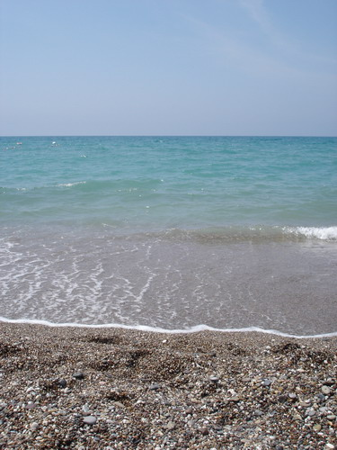
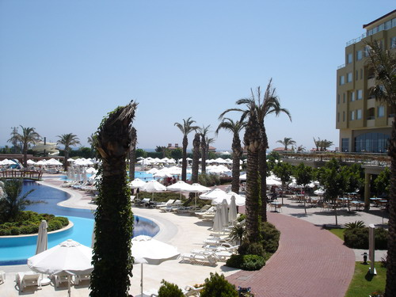
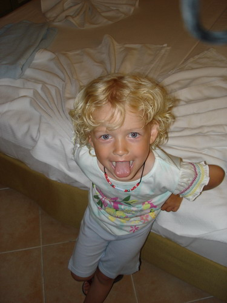

Холодно, до чего же холодно! Даже зимой, в декабре, когда хозяева уехали и у системы отопления дома кончился запас масла мне не было так холодно как сегодня. Казалось бы и лето на дворе.

А все почему? А все потому, что я вернулся на днях из отпуска в Турции. И пусть дни, проведенные в Турции, были монотонны по наполнению и немного утомительны, НО там было тепло! Температура ночью не опускалась ниже 25°C и спать можно было только с кондиционером.

Мы ездили в один из современных Эдемов на земле, так как представляют его себе турки, и, надо отметить, представляют они его вполне неплохо: море, солнце, бассейны, спорт, развлекательные мероприятия, бесплатная еда - афигенный выбор, бесплатные напитки в правильно расположенных местах - пей не хочу.

Полное описание событий укладывается в простой алгоритм:
[Цикл от 1 до 10]
[Начало цикла]
7:00 Звенит будильник, выключаю, сплю дальше, а был ли будильник??

7:хх - 8:00 (где-то в этом промежутке)
- Дядя Линкс (буду по традиции шифроваться :)), вставай (стук из-за двери и голос племяшки)
- Что? Кто?... Вставать?
- Да. Вставай. Пойдем.
- ..Обедать, тьфу, завтракать?
- Да.
- ..ээээээ.... хорошо, встаю...

8:00 - 8:30 Завтрак. Чего там только не было на завтрак. Самое главное - не увлекаться!

9:00 Загараем, да-да, уже можно загарать, либо в бассейне, либо на морском пляже. Самое главное - не жалеть крема от загара!

10:30 - (пока песок не нагреется до температуры 70+)
Волейбол или тенис. Попробовали попинать ракеткой мячики и пришли к выводу, что Маратом Сафиным нам не быть (не в этой жизни). Самое главное - одеть футболку, а на руки и лицо не жалеть крема от загара!

13:00 Обед. Ого!!! А я думал на завтрак выбор блюд огромный... Самое главное - не увлекаться!

14:00 Поваляться на раскладушке на солнце, почитать книжку. Раскладушки поставлены возле бассейна к которому можно выйти прямо из нашего бунгало. Самое главное - не жалеть крема от загара! :)

15:30 Волейбол. Самое главное - чтобы попались нормальные игроки!

18:00 Волейбол с профессионалами (довелось один раз, но был очень рад такой удаче) или баскетбол.

18:30 Плавание в море (удерживание тела на поверхности). Самое главное - не нахлебаться соленой воды через нос!

19:00 Ужин и десерт. Спокойно, в обед сдержались, сумеем и на ужин. Самое главное - оставить место для тортика! :)

20:00 Племяшка тянет родителей в Луна-парк (детские атракционы), можно составить компанию, пофотографировать - все равно ничего не получится.

21:30 Развлекательная программа. По большей части танцевальная группа демонстрирует свои умения и навыки. Впечатлен, ребята и девчата действительно молодцы! Самое главное - не зевать! :)

22:30 Полежать на кровати, дать отдохнуть позвоночнику.

23:30 иногда 0:30 Скачком просыпаюсь: блин, я же вроде собирался на дискотеку!

0:00 - 3:00 Дискотека, напитки в баре, танцы, когда музыка устраивает, поглазеть, поболтать. Самое главное - не застрелить DJ-я! Ну и не смешивать: если виски, то только виски, если текилу, то только текиллу, а уж если решил пить только кока-колу, то только кока-колу.
[Конец цикла]

Вот так в общем и целом и протекли 10 дней за исключением нескольких бонусов, вот один из них:

Мега-поездка в какую-то бухту на хм... как и назвать это судно? точно не яхта, корыто с плоской крышей? В общем час нас укачивало, пока мы тащились в обещанную бухту, 40 мин. у нас там было чтобы поплавать. Выдавались даже ласты и маски с трубками, но к моменту когда я сообразил, что это нахаляву в ящике с масками остались только обгрызенные трубки и маски с порванными лямками. Поэтому просто спрыгнул с крыши в воду и поплыл на берег - хотелось постоять на твердой земле. Затем нас еще один час укачивало, пока мы плыли назад. Обещанных дельфинов и гигантских черепах мы так и не увидели, но зато сыграли один раз в Уно (Uno).

Эх море!

Пальмы!

Закат!

[Уже был здесь](/2006/05/sunset).

Мечеть, точнее та ее часть - башня, сидя внутри которой, иммам или как там его кричит свои молитвы.

[Уже была здесь](/2006/05/a-hint).

Вот этот чертенок не давал мне спать по утрам:

Из спортивных сюрпризов.

Мне довелось играть в волейбол с девчонкой играющей в российской Суперлиге. В прошлом году она играла за череповецкую команду Северсталь. В этом пока еще не определилась с командой.

Кроме того, мне довелось играть в баскетбол (на зависть НБГ! ;)) с девчонками из Чивакаты - активными игроками. Их команда опять таки играет в российской Суперлиге.

Короче я отдыхал в одном оттеле и играл вместе со звездами российского волейбола и баскетбола! хе-хе :)

Особенно меня порадовало и приятно удивило то, что персонал оттеля в своем большинстве успешно общается по-русски.

А также прикольнуло, что в большинстве своем диалоги с теми, кто не говорит по-русске, намного успешнее шли на немецком языке, нежели по-английски. :)

Блин, все же зябко тут. Взять что ли в отпуск и поехать в теплые края?

Оригинал: [https://wobla.ru/blog/idle_lynx/2572.aspx](https://wobla.ru/blog/idle_lynx/2572.aspx)
