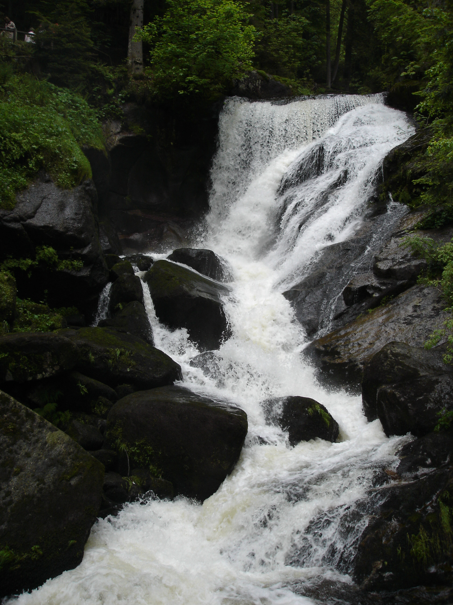

Вчера у нас был праздник. Не спрашивайте какой, я уже пытался выяснить это при помощи Википедии - не удалось. Ой, нашел :) Pentecost Monday - следующий день после Дня Святой Троицы (Pentecost, Pfingsten), который всегда приходится на воскресенье. Короче, вчера мы не работали.

Делать было нечего и утро было солнечным, поэтому я с коллегой по работе решили сгонять в Триберг (Triberg). Для тех, кто не знает географии Шварцвальда, Триберг - это маленький городок в наших краях, знаменитый своими водопадами.

Названия этого городка уходит своими корнями в далекое прошлое. Достоверно известно лишь, что берг (Berg) в переводе с немецкого означает гора. Поэтому с достаточно высокой степенью вероятности можно предположить, что Триберг - это Троегорье по-русски.

Когда мы добрались до города, погода решила, что выдала дневную норму солнечной энергии и затянула небо тучами. Весь оставшийся день был хмурым и пасмурным, блин.

Вот такими хмурыми улицами встречал нас Трибегр:

По ходу ни одной путней фотографии водопада у меня не получилось. За это надо благодарить замечательную погоду, мой супер-фотоаппарат и его оптику и мои мега-навыки в фотографировании :) Поэтому выкладываю что есть, уж не обессудьте.

Водопад во всей его красе (теоретически) - 3 крупных порога:

Нижний порог водопада с предыдущей фотографии:

Верхний порог водопада с первой фотографии:

Почти провалившаяся попытка заснять бурлящий поток, ну что-то все-таки видно :)

В заповедную зону водопадов можно попасть с нескольких сторон, но все входы перекрыты маленькими будками, где необходимо либо купить билет, либо предъявить купленный в другой будке.

Здесь же можно купить пакет земляных орехов, чтобы погрызть самому или покормить белок - таким образом хитрая администрация не тратит, а зарабатывает деньги на кормежке живности, обитаемой на территории заповедника.

Орехов мы не купили, поэтому когда подошли к месту обитания белок - те просто разбежались, звиняюсь, фотографий нет :)

Вид на городок откуда-то сверху:

Поток в движении:

А сегодня у меня последний день отпуска. Солнышка вроде бы чуть больше, чем вчера, но делать ничего не охота, поэтому я пишу дневник :)
