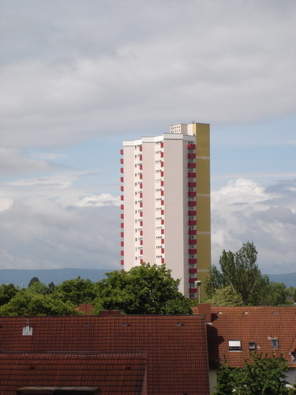

Продолжая тему пролетарского вида построек, начатую [здесь](/2005/12/view-out-of-window), выкладываю очередной шедевр в данном направлении, снятый кстати, опять таки в городке Воблыча:

Lynx возвращался домой после пары матчей пляжного волейбола, которые он привык проводить в бассейне под открытым небом, что расположен в его городке.

Нет, он не увидел интересную сцену и это его немножко огорчала, его фотоаппарат лежал в рюкзаке нетронутым. Но его гложила мысль: надо пеарить свой дневник, а то вон, Оле - молодец, как раскрутился!

И тут ему пришла гениальная мысль: поднять архивы. "Кадр получился интересным," - подумал Lynx, глядя на снимок, - "Не шедевр конечно, но гамма цветов мне нравится... ладно, будем работать, а пока сойдет и так и небо живописное, а это главное".

Надо бы еще пару предложений про каникулы в школе написать.. О!!! мой братик сейчас парится, у него диплом на носу! Нука все дружно, ругаем его 2 недели (потому что я не уверен какого он защищает диплом)!

Ну а про грядущие выборы я вообще молчу.
