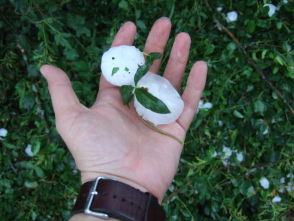
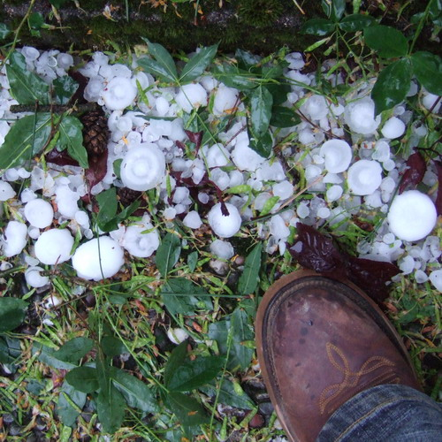
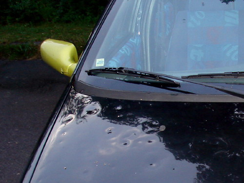

Возвращаясь вчера с..., нет не с пикника, а с работы немного пораньше я совсем не догадывался, каких крупных неприятностей мне удалось избежать.

День выдался теплым и солнечным, хотя к вечеру прохладало и небо затянуло дождевыми тучами, НО НИЧТО не предвещало той природной напасти.

Около 8 часов вечера мне позвонил колега по работе и спросил:
- Ну и как ты пережил это?
- Что?
- Как что? Ты что не заметил града?
- Э... - стоит отметить, что я был несколько занят предыдущие 2 часа, поэтому не особо обращал внимания на то, что творилось за окном.
- Мою машину побило градом, вот только что звонил в страховую компанию, сказали, что страховка компенсирует такие случаи, - сказал коллега, - а как там у тебя?
- Э-эээ, - снова затянул я и, не ложа трубки, двинулся на улицу, в душу начали толпами забираться опасеиния...
- Уфффф! Не, видимо до нас не добрался, - с облегчением сообщил я коллеге.

Опасения развеялись, да, у нас моросил дождик, но не более, моя машинка стояла в целости и сохранности.

Далее мне поведали, что в течении 15 мин. в городе где я работаю, что всего лишь в 20 км. от городка, где я живу, шел град, и не просто град, а град офигенных размеров. Большинство машин, что стояли под открытым небом, пострадали в той или иной степени: у кого-то побило лобовые и задние стекла, у кого-то раскромсало фары, но абсолютно у всех машин помяло крыши и капоты.

Пострадали и несколько человек из тех, кто неудачно вышел на улицу в это веремя или, возможно, пытался спасти свою машину.

Коллеги поделились со мной несколькими фотографиями, которые наглядно дают представить себе размер градин:

Вот таким образом метит град свои жертвы:

Сегодня я видел множество машин с такими отметинами, а также лобовыми стеклами заклеенными полиэтиленом.

Говорят, что такое случается здесь уже не в первый раз...

Оригинал: [https://wobla.ru/blog/idle_lynx/2659.aspx](https://wobla.ru/blog/idle_lynx/2659.aspx)
