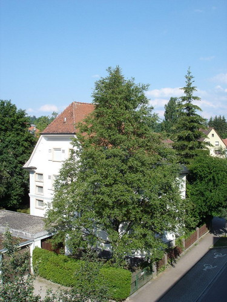

В продолжение разговора на счет возможностей и невозможностей 2-х мегапиксельных телефонов провел сегодня небольшой эксперимент на своем любимом объекте. Использовал все свои устройства, оснащенные встроенными цифровыми фотоаппаратами.

Сразу извиняюсь за чистоту эксперимента. К сожалению, могу предоставить результаты сравнения лишь техники 1.5 - 2-х летней давности, поэтому возможностей 2-х мегапиксельных телефонов продемонстрировать не могу. Качество у них будет определенно лучше, чем у представленного образца, но общая тенденция, я думаю, сохранится.

Итак, первый кандидат: сотовый телефон
Фирма: Motorola
Модель: V600
Актуальность модели: август 2004 г.
Макс. разрешение: VGA (640x480)
Макс. zoom: 4x

Съемка в режиме максимального разрешения, без зума, яркость средняя, остальные параметры по умолчанию, после съемки кадр ужат до разрешения 500x375:

Второй кандидат: наладонник (PDA)
Фирма: Asus
Модель: MyPal A730W
Актуальность модели: январь 2005 г.
Макс. разрешение: 1.3 Mpix (1280x960)
Макс. zoom: 1x

Съемка проводилась в максимальном разрешении, при установках яркости/контрастности по умолчанию, без специальных эффектов, после съемки кадр ужат до разрешения 500x375:

Третий и последний кандидат: цифровой фотоаппарат
Фирма: Sony
Модель: DSC-W12
Актуальность модели: июнь 2004 г.
Макс. разрешение: 5.1 Mpix (2592x1944)
Макс. zoom: 3x (оптический)

Съемка проводилась в полуавтоматическом режиме, без зума, в максимальном разрешении, нормальный уровень JPG-компрессии, никаких специальных настроек по изменению яркости/контрастности изображения, после съемки кадр ужат до разрешения 500x375:

Дополнительно, для чистоты эксперимента, провел съемку камерой Sony в режиме 1 Mpix (1280x960), чтобы эмулировать работу встроенной камеры наладонника (по мегапикселам), после съемки кадр ужат до разрешения 500x375:

Делайте выводы. И это съемка при хорошем солнечном освещении около 4-х часов вечера. При более слабом освещении результаты еще плачевнее.

Ну и до кучи, раз уж выложил столько фотографий, то одной больше, одной меньше :) Вот такой ореол я сфотографировал сегодня вечером в бассейне аппаратом предназначенным именно для съемок:

В волейбол мне сегодня так и не удалось поиграть :(

Оригинал: [https://wobla.ru/blog/idle_lynx/2667.aspx](https://wobla.ru/blog/idle_lynx/2667.aspx)
