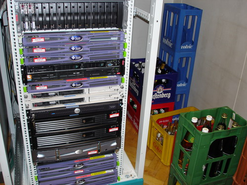
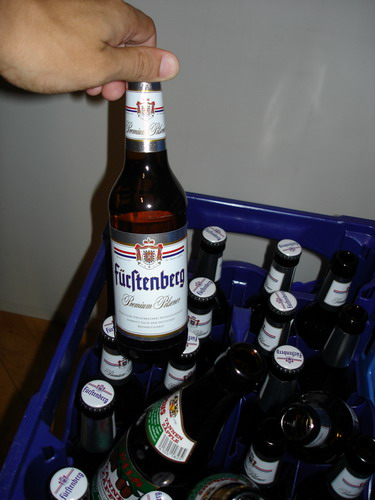

Возвращаясь... ой не, о чем это я?

Как известно интеллектуальный труд требует огромных затрат энергии, как физической, так и эмоциональной. Для поддержания морального духа работников нашей компании начальство делает все, чтобы мы чувствовали себя комфортно и могли выполнять свои задания на 100%

На каждом этаже компании расположены автоматы по завариванию кофе, там же можно затариться шоколадками, соломкой и другой снедью - какая же интеллектуальная работа без шоколада? :)

Кроме того, что особенно важно в эти жаркие летние дни, нас - самоотверженных работников компании - снабжают абсолютно "на халяву" напитками: соками, минеральной водой, кока-колой...

Позвольте, скажете вы, где же хранить по такой жаре эти самые напитки? Холодильников на всех не напасёшься. Вопрос совершенно справедливый. Но цепкий ум и смекалка найдут выход из любой ситуации. Такие умы есть и в нашей компании. Напитки храняться в самых холодных помещениях, специально оборудованных высококачественными кондиционерами с регуляторами температуры и круглосуточной сигнализацией на случай если последняя поднимается выше критической отметки в 18 - 20 градусов. Напитки хранятся в помещении с серверами компании :)))

Давайте присмотримся поближе:

Вот что я называю "правильной мотивацией" работников! ;)
