Не то, чтобы у меня выдалось до кучи свободного времени, но подумал, что если долго затягивать, то в конце-концов могу забыть/забить и вообще ничего не рассказать.

Опубликовав в предыдущий раз коротенькую запись [про Страсбург](/2006/08/inspiration), я сообразил, что вряд ли кто-нибудь представляет себе о каком городе идет речь.

Этой записью я попытаюсь пролить немного света на этот несомненно красивый и достойный внимания город, и не столько рассказать, сколько показать в картинках его основные туристические достопримечательности.

Итак, Страсбург, несмотря на свое по-немецки звучащее имя, в настоящий момент находится на территории Франции по праву считается французским городом. Находясь на стыке границ Франции и Германии на протяжении всей своей истории город постоянно переходил из одних рук в другие и обратно. Последний такой переход произошел в 1940 году в руки набирающей свою силу Германии и затем в 1944 году обратно к Франции по очевидным причинам.

Теперь уже никто не помнит, кто же заложил первый камень, выкладывая мостовую города: был ли то французский крестьянин, немецкий каменщик или римский солдат, достоверно известно лишь что город насчитывает более 16 веков истории.

Исторический центр города окружен живописно украшенным каналом, который наполняется водами реки Иль одна из многочисленных рек питающих своими водами Рейн протекающий по границе Франция-Германия буквально в 5 км. от города:

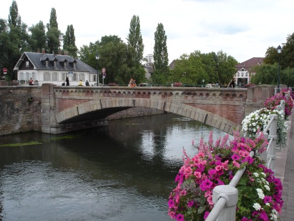

Центр города сохранил средневековую архитектуру и дух прошлых эпох. Маленькая Франция (la Petite France), так называется южная часть центра города, где мостовые выложены камнями, по которым стучали башмаки людей и колеса карет предыдущих столетий:

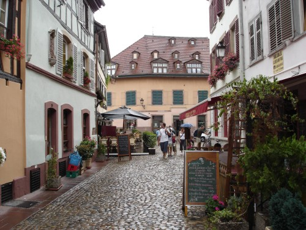

Двигаясь от Маленькой Франции к центру ориентируясь на возвышающюся башню Страсбургского Нотердамского Собора (Cathédrale Notre-Dame de Strasbourg), нельзя пройти мимо площади с удивительно-красивой каруселью, датированной 1900-м годом:

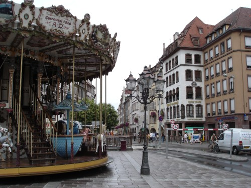

Но не будем задерживаться и поспешим к главной достопримечательности города - собору выстроенному в классическом готическом стиле:

И ракурс поближе:

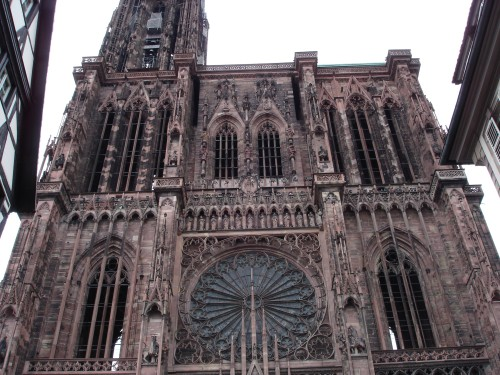

К сожалению монументальность таких грандиозных сооружений рук человеческих с трудом передается на фотографиях. Вдохновленно смотришь на собор, под впечатлением масштабов, решаешься запечатлеть все это на память, поднимаешь фотоаппарат и понимаешь, что собор не влезает на в рамки фотографии, отходишь на достаточное расстояние, фотографируешь, смотришь результат: нда, ну и где же вся грандиозность? :(((

Ну да ладно, оставим эти мелкие проблемы в стороне и зайдем внутрь собора:

Как и любой другой уважающий себя собор, данный является обладателем огромного действующего оргáна, повешенного сбоку в пролете между колоннами основного зала:

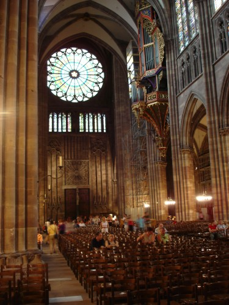

Вот так симпатично выглядит оргáн при более близком рассмотрении:

Однако есть в Страсбургском Соборе и нечто особенное, отличающее его от других католических соборов. Вот эти астрономические часы доказывают революционность взглядов и поддержку науки в кругах французской католической церкви (не спрашивайте меня, что они символизируют ^_^):

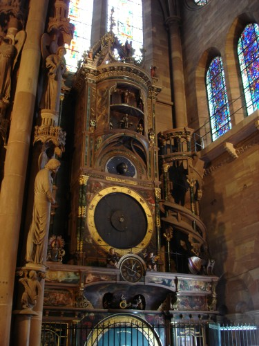

В более современной северной части центра города по улицам бегают современного вида трамвайчики:

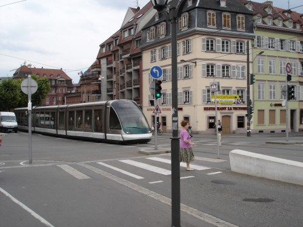

Возле одной из остановок, к нам подошла девушка и попросила принять участие в съемках фильма. От наст требовалось пройти на остановку, дождаться следующего трамвая и после этого можно считать миссию выполненной. Мы успешно справились с заданием, так что может быть даже попадем когда-нибудь на экраны кинотеатров. Впрочем, скорее всего, сцена будет просто пылиться где-нибудь в съемочных архивах и никогда не станет частью фильма.

Девушка поведала нам сюжет фильма, но мне что-то влом его пересказывать. Типичная жизненная история, снималась людьми молодого возраста, скорее всего студентами какой-нибудь Страсбургской кино-академии :)

Другой, меньший по размерам, но не менее знаменитый, чем Нотердамский собор Страсбурга:

Пусть он и меньше, зато у него целых 2 башни! Эх, все же пасмурная погода моментально снижает качество фотографий :(

Но не только историческими постройками и соборами знаменит Страсбург. Город также имеет огромное политическое значение в европейском и мировом масштабе. Да-да-да именно в этом городе заседает Европейский Парламент. Именно в этом городе и именно в этом здании:

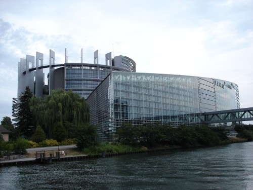

Другой ракурс на то же самое сооружение (вид с запада, а может быть с севера):

Рядом со здание Европейского Парламента, буквально по другую сторону реки расположено не менее важное по своей политической значимости сооружение Европейский Суд по Правам Человека:

Столько много воды - не спроста, тут возят ахающих туристов на плоских лодках и демонстрируют чудеса исторической и современной архитектуры, а что, тоже бизнес:

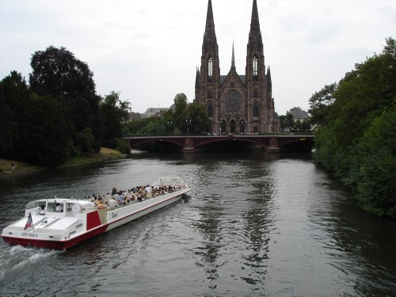

Страсбург, если кто не знал, славиться своими велосипедами, нет не производством, а инфраструктурой для велосипедистов. Есть подозрения, что велосипедистов в городе не меньше, а может быть даже и больше, чем автомобилистов. Правда в тот памятный пасмурный понедельник они встречались крайне редко, зато разлиновка пешехдно-велосипедных тротуаров меня порадовала:

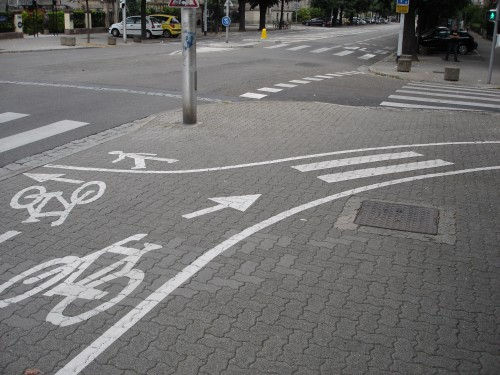

Хе-хе, зебра для перехода через велосипедную дорожку, идущую по тротуару, может еще и светофоры в подобных местах установить? :)

Ну и до кучи, пара уголков из центральной части города, что приковали мое внимание:

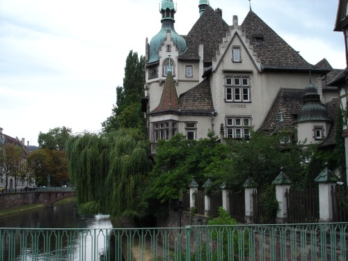

Из района Маленькой Франции:

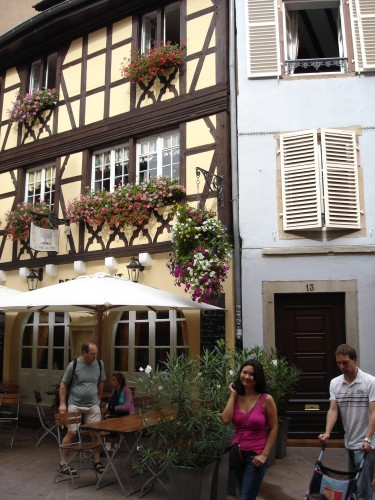

Где-то тут неподалеку, чуть левее, сидела та молодая художница:

Вот собственно и она, еще раз :), рисует сюжеты города, красиво рисует, стоит отметить:

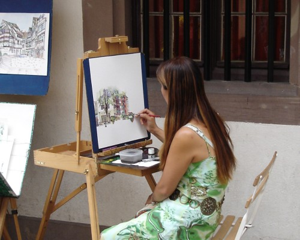

И ни чуточки не страшное окно на заднем плане, просто день пасмурный задался :(

Вот так, вкратце и в картинках о Страсбурге, красивый город, со своей длинной историей и приятной атмосферой спокойствия.
