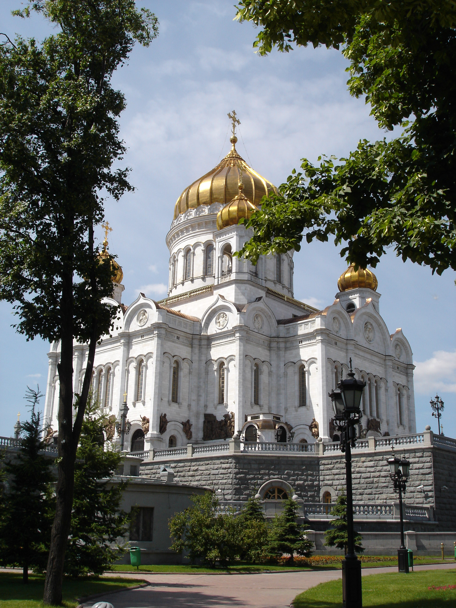

Храм Христа Спасителя. Навеянное.

Посмотрел на [фотографии Лесси](https://wobla.ru/blog/Lessi/2860.aspx), и 3-я напомнила мне одну из моих фотографий, что я нащёлкал в день проведенный в Москве и всецело посвященный.. нет не фотографированию, а МИД РФ.

История длинная и достаточно скучная, а вот фотография по-моему симпотичная:

Вроде бы еще не выкладывал ^_^
