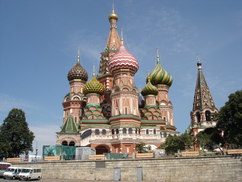
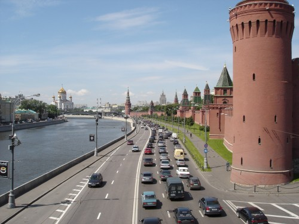
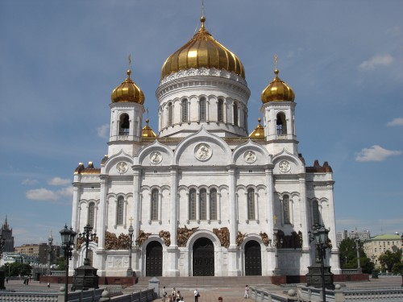
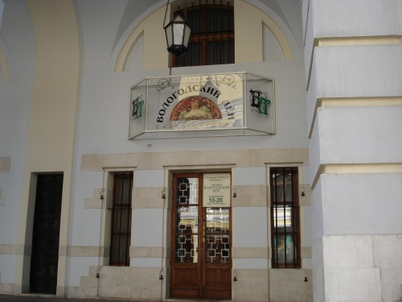

[Одной фотографией](2006/09/moscow) не рассказать о Москве, да и серией фотографий тоже, но раз уж выложил первую, то решил, что стоит хотя бы показать самые интересные снимки из коллекции.

День тогда был замечательный и проподал он зазря из-за бюрократических проблем, поэтому отдав все необходимые документы в МИД я пошел шататься по городу и фотографировать.

Вот это одна из первых жертв, что попалась на встречу мне и моему фотоаппарату. Очень симпатичная церквушка, недалеко от Красной Площади, правда не знаю ее названия:

Ну, собственно, банальная классика:

Вид с моста на реку Москва (справа Кремль и Красная Площадь):

Храм Христа Спасителя (фас, эм... фронтальная съемка, кажется спецы это так называют):

Ну и это, бонус, проходя мимо не мог не сфотографировать:

Оригинал: [https://wobla.ru/blog/idle_lynx/2867.aspx](https://wobla.ru/blog/idle_lynx/2867.aspx)
