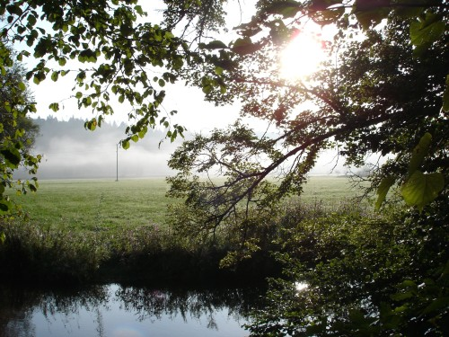
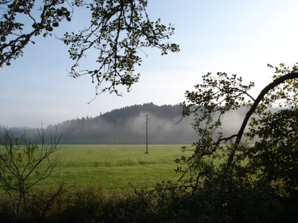
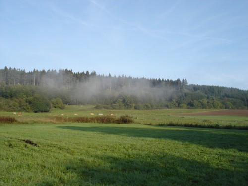
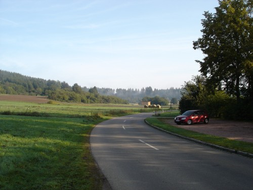

..и снова не раннее :)

Ехал я сегодня на работу и любовался красочными пейзажами украшенными дымкой утреннего тумана, ну и это, решил, что надо все же остановиться и запечатлеть эти красоты.

Получилось 20+ фотографий, пытался выбрать 2-3 лучших, но меньше 5 не получается ^_^ потому как сюжеты несколько разные. Конечно, не шедевры, но все же.

Собственно мой любимый сюжет (туман, река, солнце, ветви):

Туман над полем и телеграфный столб :)

Куст (большой):

Поле:

Поворот:

Ну и это, снова любимый сюжет, только вертикально:

Старался для вас ^_^  
Линкс

Оригинал: [https://wobla.ru/blog/idle_lynx/2891.aspx](https://wobla.ru/blog/idle_lynx/2891.aspx)
