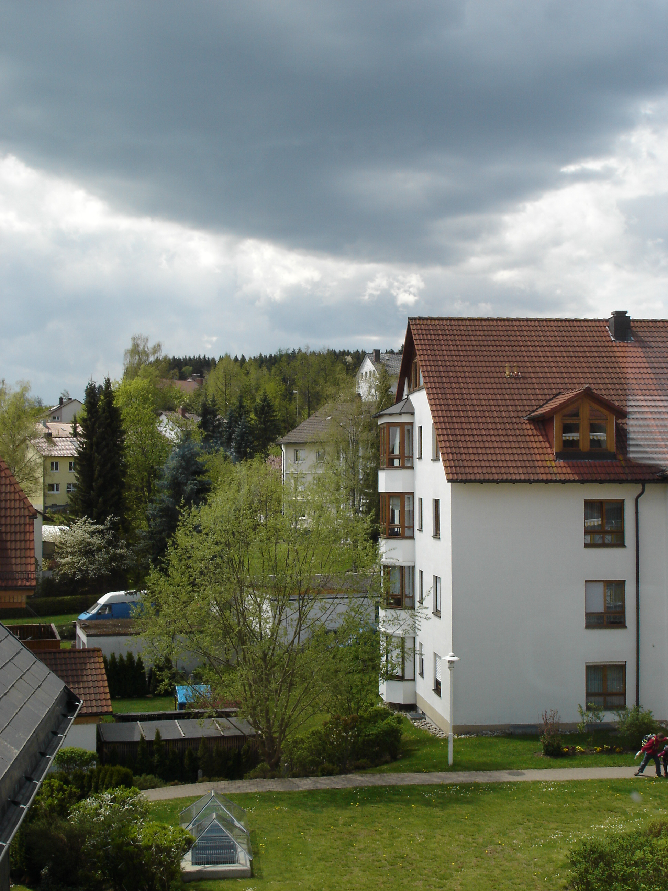
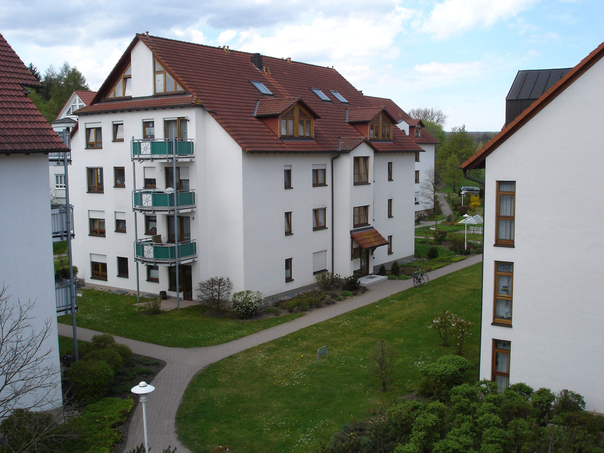
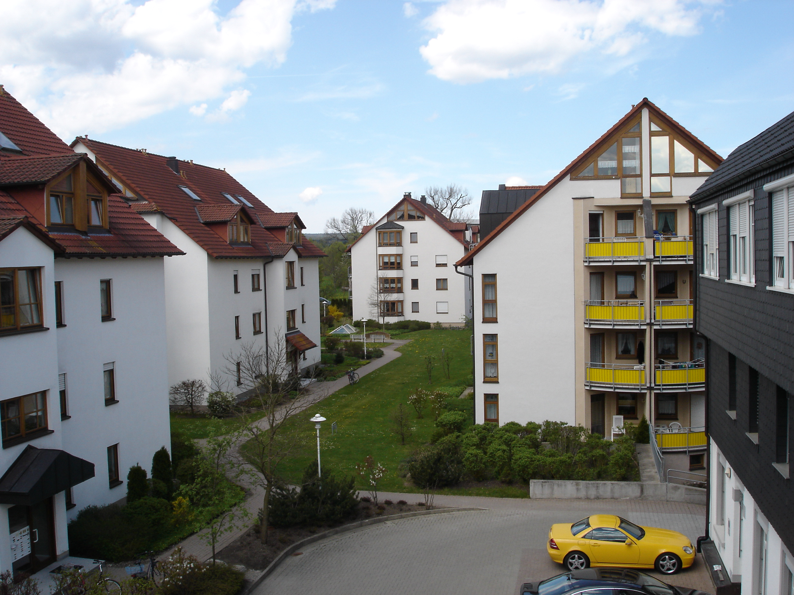
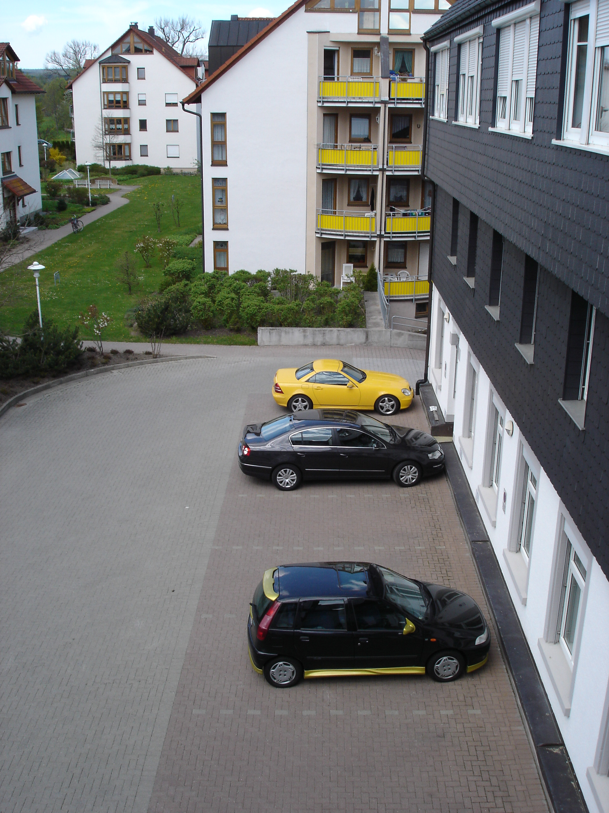
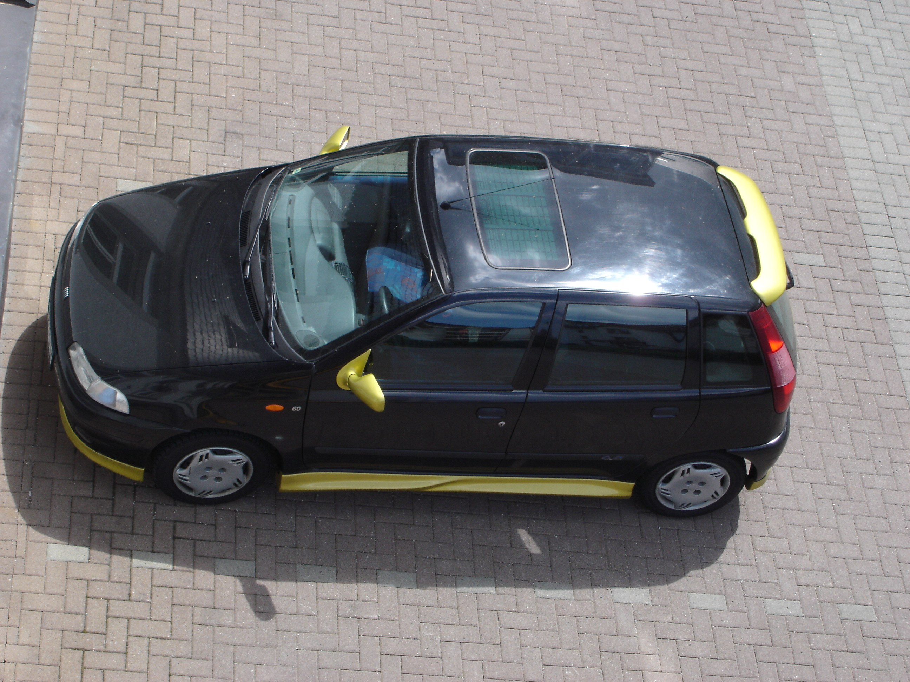

Исполняя [просьбу xelakos'а](https://wobla.ru/blog/idle_lynx/2908.aspx), выкладываю фотографии видов из окон с другой стороны здания.

Как tanchik верно подметила, фотографии я делаю с рабочего места и, по большей части, в рабочее время, поэтому все фотографии обычно заканчиваются одним и тем же сюжетом: осточертевшим домиком с кирпичной крышей.

В настоящий момент, спасибо погодным условиям, ни с той и не сдругой стороны здания ничего хорошего не получиться.

Но порывшись в своей коллекции, нашел парочку красочных фотографий сделанных в мае этого года:

Вот так выглядят многокварирные дома в небольших городках Шварцвальда:

С этой стороны здания расположена наша парковка:

А вся фотосессия затеивалась в тот день по просьбе моего коллеги, который хотел, чтобы я сфотографировал его машину:

Которую потом офигенно офигенно побило [небывалым градом](/2006/06/15-min).

А была такая симпатяшка:

