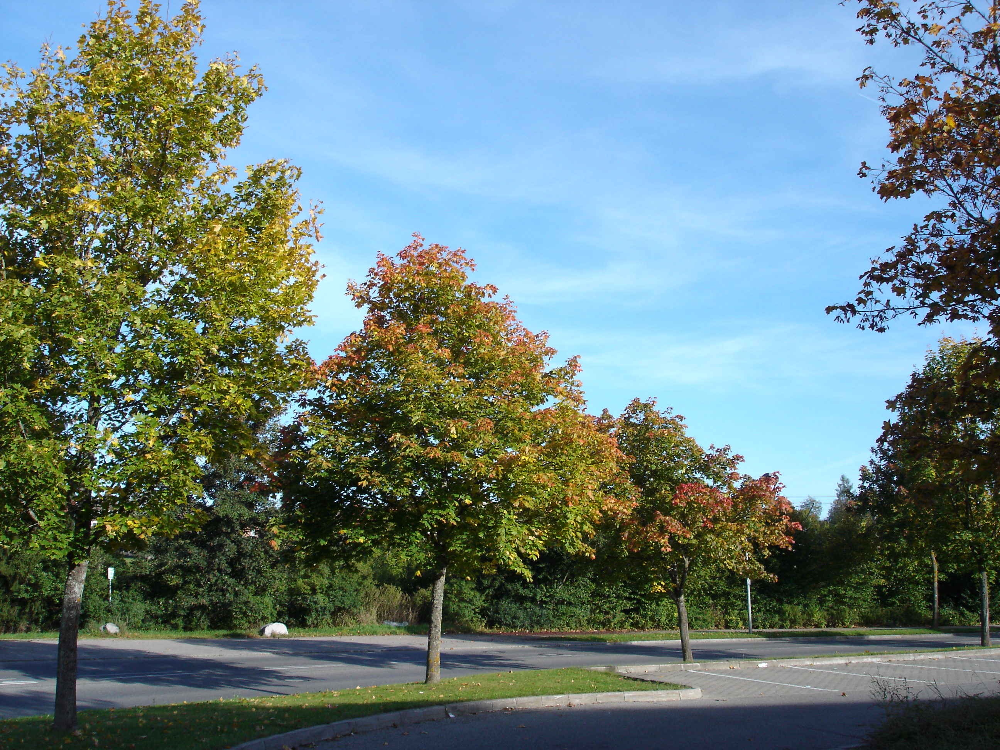
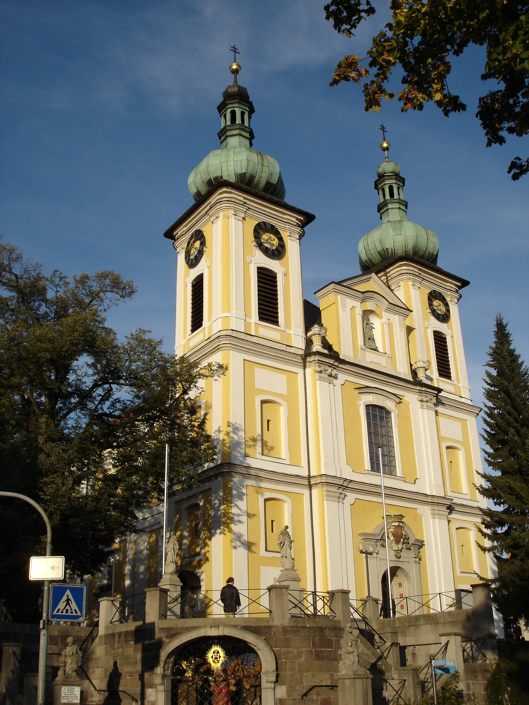
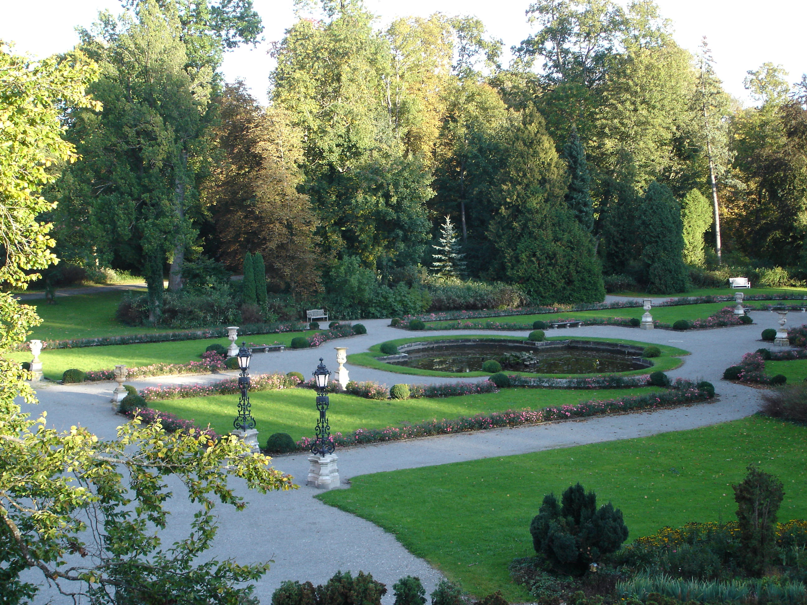

Осень потихоньку приходит и в наши края.

Еще по большей части тепло, хотя вечерами становиться зябко, солнышко старается изо всех сил, но видно что сила его желания слабеет изо дня в день, деревья переключили свой ритм на осенний режим и начали потихоньку готовиться к зиме:

Прошлую неделю стояла пасмурная погода, позапрошлую лил дождь, либо шла мелкая изморось, но эти выходные выдались на удивление солнечными. Делать было нечего, как обычно, но дома сидеть не хотелось, поэтому я взял фотик и пошел фотографировать окресности:

Вот так выглядит наша местная достопримечательность - католическая церковь (а может быть даже и собор) вполне классической архитектуры:

Прямо у подножия этой церкви расположен исток р. Дунай :) а еще чуть в сторонке высится настоящий дворец нашего местного князя. Дворец весь в лесах, поэтому он не "фотогеничен", а вот окружающий его дворцовый сад выглядит примерно вот так:

Раньше туда был свободный вход и можно было гулять между "грядками" и "клумбами", любоваться живописными дорожками, а также дворцом с близкого расстояния. Но вот уже как 3-й или 4-й год, семья князя, уставшая от назойливых туристов, отгородилась от всех железными заборами и вход на территорию дворцового сада теперь недоступен обычным прохожим.

Ну и на последок, предзакатное небо:

