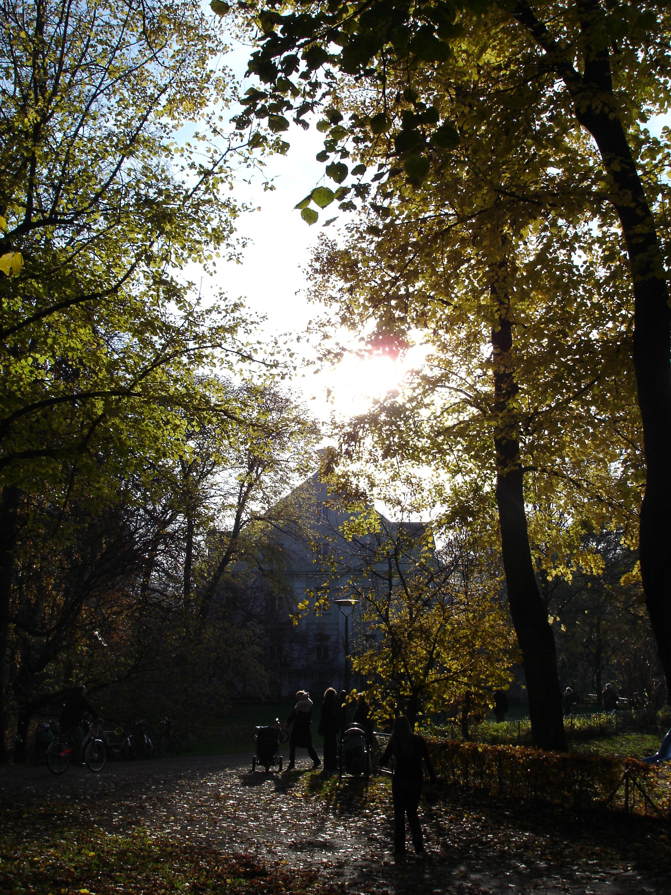
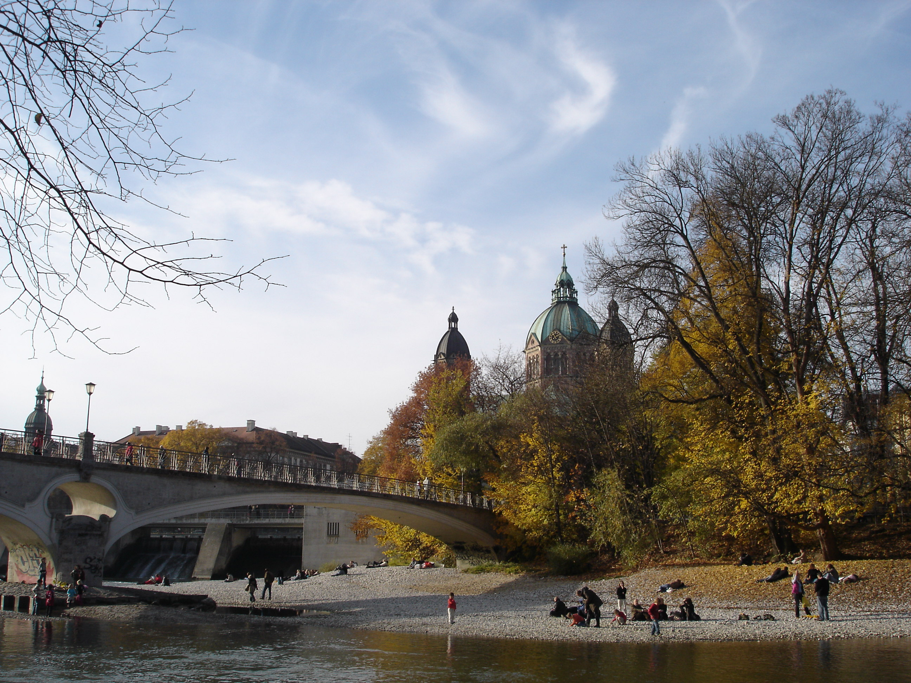
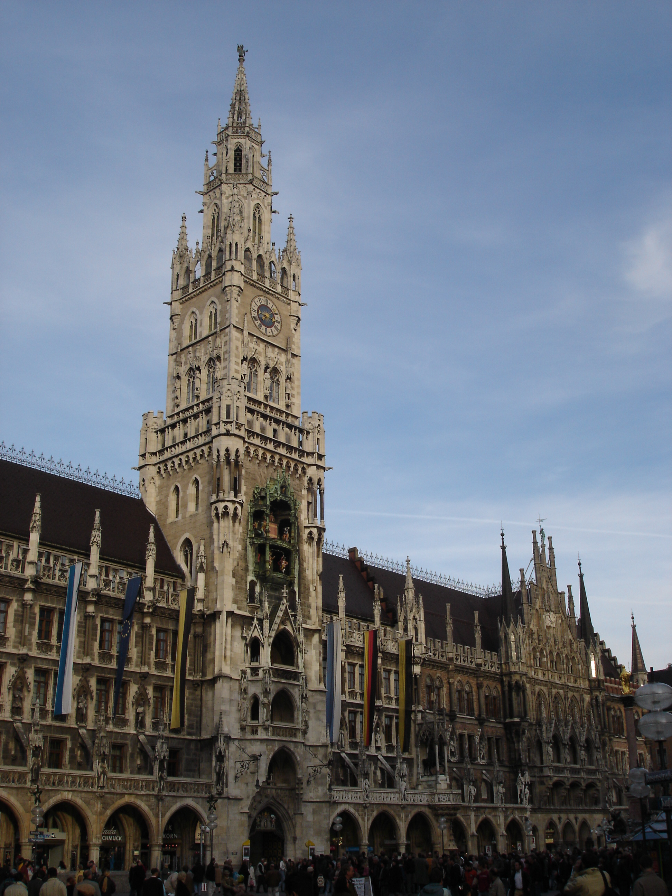
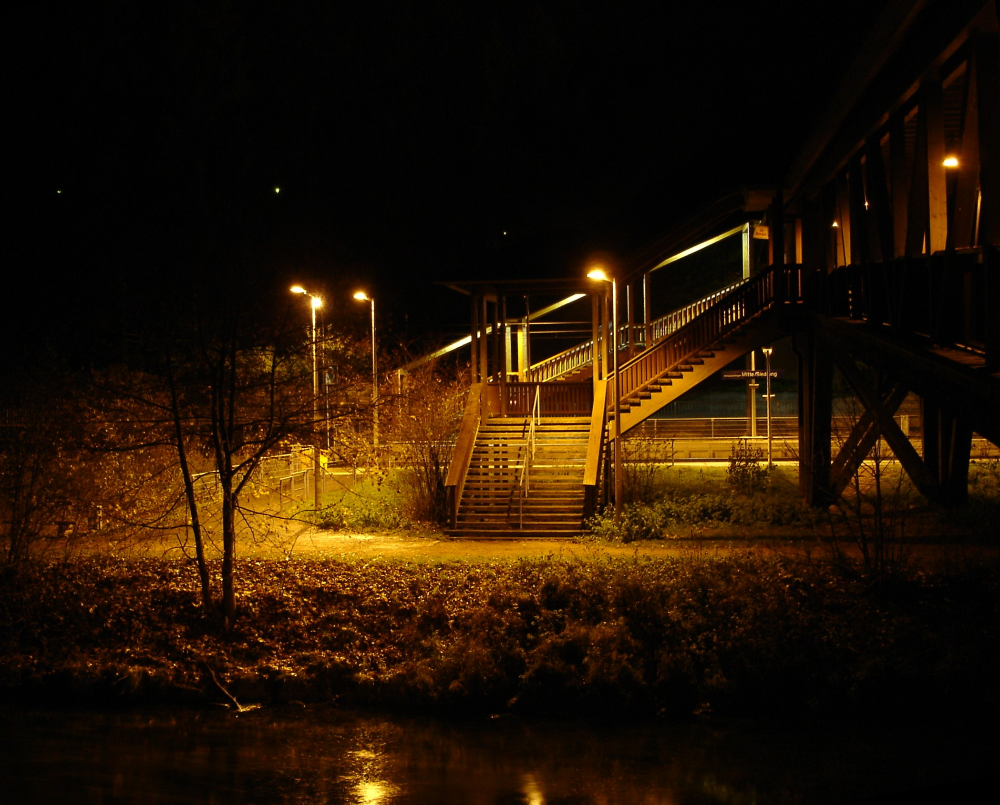
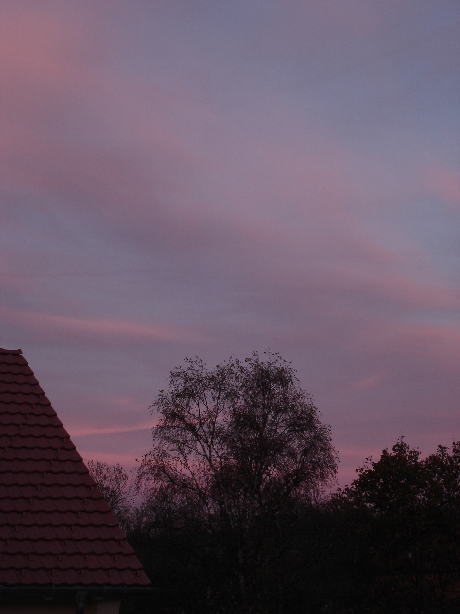

После моего последнего рассказа про Париж меня успели несколько раз упрекнуть в том, что я никого не предупредил, никому не сообщился о своих планах, а также, до кучи, в дюжине других «грехов». Да, я такой, да я предпочитаю сначала съездить, увидеть, развеяться, а потом рассказывать об этом, нежели сообщать о том, что мои планы провалились. Вот, например, судя по всему мои планы навестить Вологду на новый год провалились, ну и фиг с ними. Эх..

Зато в прошедшие выходные – и снова я никому ни о чем не сообщил :р – я был в Мюнхене. В пятницу забил пораньше на работу, сразу после обеда, слинял домой, затем на вокзал и укатил в столицу Баварии. Добрался туда лишь под вечер, но там меня уже ждали.

Что может быть лучше теплого приема в гостях у старого друга, с которым не виделся уже 2 или быть может 3 года, когда как до этого привык проводить пол-дня в дискуссиях на рабочие темы, вечера – в кабаках, а пятницу и субботу на вечеринках и дискотеках.

Меня конечно предупредили заранее, но кто же мог поверить, что это серьезно: мой приезд решили отметить по-русски, так как это понимают бразильцы, – с бутылкой «Абсолюта» :) и др. бодрящими напитками. Отметили очень хорошо, так хорошо, что на следующее утро не хотелось вставать. Когда же я поднялся, то продолжал клевать носом. Друзья веселились, а я вдыхал аромат кофе и думал: «странно, ведь выпили примерно одинакого, как им удалось остаться в таком отличном состоянии?» И вдруг Фернандо спрашивает: «Вова, неужели у тебя голова не болит? У меня там свинцовые шары катаются.» Мне захотелось рассмеяться, но я лишь выдавил слабую улыбку: «есть немного.»

К полудню, хм... часа через 2, мы все пришли в норму и пошли есть суши. Ааааааа... Почему у нас в округе нет японских ресторанов?! Я бы туда ходил бы как минимум раз в неделю. Впервые видел такую организацию подачи пищи, может быть и не ново, но все равно расскажу. Через все помещение змейкой протянут маленький 2-хэтажный конвейер. Вдоль конвейера по обе стороны расположены небольшие 2-х и 4-х местные столики, со стороны транспортера раздвигаются створки из оргстекла и вуаля: доступ к проезжающим с приличной скоростью изделиям японской кухни, по большей части из риса, сырой рыбы, осьминогов, икры, а также специи и приправы. Каждое изделие в одном экземпляре на отдельной пластиковой тарелочке. Стоит все это удовольствие 11 евро, зато ешь, сколько хочешь, бери все, что понравиться. Скапливающиеся горой на столе тарелочки вовремя убираются низенькими официантками очевидного японского происхождения.

Ну мы и ели-ели-ели :) в определенный момент, уловив сигналы организма, о том что это предел, я перестал есть – все таки это была рыба :( пусть и очень вкусная. Но лучше сдержать себя один раз, нежели потом мучаться 2-3 месяцы. Друзья продолжали уплетать вкуснятину.

Когда все объелись сушами, мы пошли по магазинам. Нужно было купить блок питания к умершему компьютеру.

Попытка реанимировать компьютер показала, что умерший блок питания прихватил с собой на тот свет и мамку. Значит не судьба, ну и фиг с ним.

Вечером мы сидели в приятном бразильском баре, слушали бразильские песни и игру на гитаре, потягивали капиринью, уплетали сладкую картошку запеченую во фритюре и вели неторопливые беседы.

Утро следующего дня показало, насколько же приятнее просыпаться со светлой головой :) Но чтобы понять разницу можно иногда и «расслабиться», разок в году.

С самого утра ярко светило солнышко. К сожалению, у меня было только полдня, после чего я должен был покинуть этот оживленный но уютный город. Мне предложили поехать в парк поиграть в настольный теннис. «Ничего не имею против,» – был мой ответ. Мы одели ролики (нашлась пара и для меня) и поехали в парк. Этим летом мне так и не удалось покататься на своих роликах, хотя в прошлые годы, не проходило ни одного воскресенья без них. Однако отсутствие практики в течении года не сказалось на моих «талантах». Было классно снова почувствовать свободу в передвижении и скорость, прыгать я не стал – все же коньки не мои, сырой и покрытый опавшей листвой асфальт пешеходной дорожки, рюкзак за плечами, да и не было времени размяться как следует.

Добравшись до теннисных столов и решив проблему с сеткой (кто бы мог подумать, что стол будет толще стандарта, а может быть крепления сетки тоньше), мы провели несколько матчей. Ну... ну да я никогда особо и не играл хорошо в настольный теннис ^_^ Да и вообще настоящий спорт – это баскетбол :))) Шучу, конечно, я люблю играть в теннис, но Фернандо был лучше, ммм... намного лучше. В этот промежутке между матчами, когда Фернандо обыгрывал свою девушку, я вспомнил, что у меня с собой есть фотоаппарат.

Вот так примерно выглядит парк где мы играли в настольный теннис:

А вот такой вид открывается на реку, вдоль которой расположен парк. С этого берега незадачливые рыболовы пытались что-то выудить из речки, а с той стороны маленькие дети кидали гальку и распугивали всю рыбу:

Время, как известно не остановить, а в хорошей компании оно пробегает вообще незаметно, поэтому мы двинулись ближе к центру, ближе к вокзалу.

Пожалуй единственным интересным туристическим объектом, который я сфотографировал в этот раз в Мюнхене, можно считать вот эту знаменитую Мюнхенскую Ратушу, расположенную на Мариенплац (одна из главных площадей города):

Пришло время расставаться, пришло время ехать домой: пять часов с пересадкой в Ульме, пять часов почитать, послушать музыку, подумать, поспать, и снова почитать.

По пути со станции, несмотря на то, что моросил холодный дождик и хотелось побыстрее добраться до дома, решил таки остановиться и сделать ночное фото деревянного моста:

Ну и совсем оффтопик, пытался на прошлой неделе сфотографировать розовые краски заката, сделал штук 15 фотографий. Результат почти нулевой - цвета заката были совершенно другими, по сравнению с тем что вышло на фотографиях. Ужас! Вот пример моих поражений:

А в действительности был таааакой закат, что заставил меня потянуться за фотоаппаратом.

Как-нибудь продолжу рассказ про Париж.
