* * *

Все началось еще в прошлую пятницу. А может быть даже и раньше. Но ведьмы были в пятницу. Ах, да, в четверг был день всеобщего обжорства – последний день перед началом поста. Никто не следил за порядком. Силы зла не преминули воспользоваться такой возможностью.

Первыми среагировали ведьмы и колдуньи. Они устроили шабаш, со своими странными и зловещими ритуалами, направленными на закрепления и усиления черной магии. Ведьмы стекались со всех улиц и переулков, все в черном, в кромешной тьме, когда по одиночке, когда парами, а иногда и целыми сектами.

Разведя огромный костер в центре торговой площади они приступили к своим обрядам, танцы, магия, зловещая музыка, прыжки через костер. Эманации злой силы растекались по городу в таких объемах, что зашкаливали приборы и засвечивалась пленка, поэтому, к сожалению, никаких документальных данных о данных событиях не сохранилось.

Честной народ в эту ночь сидел дома и не рисковал выходить на улицу. Те, кого заставила необходимость выбраться в ту ночь, заблаговременно позаботились и приобрели дохлую кошку, привязанная к шнурку левого ботинка она успешно защищает от поползновений нечистой силы.

* * *

В субботу на вечер были запланированы празднования, выступления, танцы и дискотека у гимнастов и прочих спортсменов. Но в силу обстоятельств предыдущей ночи никто не рискнул прийти на бал в своем обычном обличии: рыцари, джин, вампиры (целое семейство), кошечки (некоторые очень даже ничего ^_^), волки, зайцы, ягоды и даже хирурги :) кого там только не было!

Ваш покорный слуга – спасибо друзьям – предстал не привлекающим особого внимания клоуном. В тот момент мне казалось, что маскировка удалась:

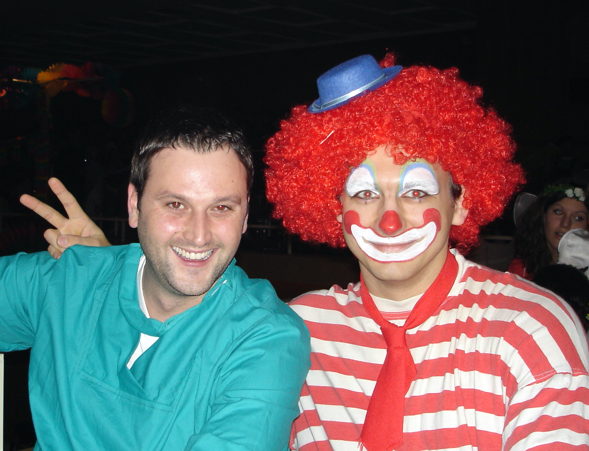

К сожалению, праздник длился не долго. Одной только развлекательной программы для всей этой толпы нечистой силы было не достаточно. Чтобы вампиры и прочая нечисть не дай бог не начали бесчинства, приходилось в оперативном порядке утолять их жажду. Но работники на раздаче напитков не справлялись. Чтобы предотвратить конец света, на помощь организаторам пришли крестьяне, ангелы и другие добрые герои:

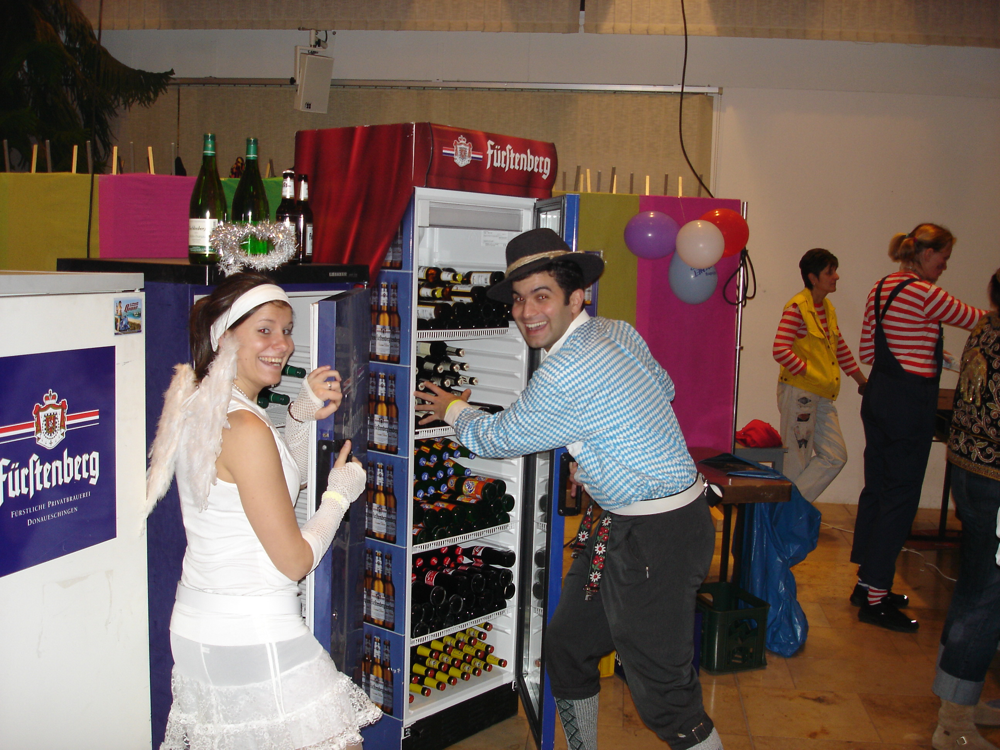

Три часа на раздаче напитков пролетели как пять минут, потом добрые герои позволили себе расслабиться, выпить, потанцевать. Далеко за полночь один за другим понемногу все разбрелись по домам и город умиротворенно уснул.

Вы думаете на этом все закончилось? Ха-ха. Еще даже ничего и не начиналось. Все это было лишь разминкой перед тем что случилось в воскресенье.

* * *

“Narri!“ – кричали выступающие.
“Narro!“ – вторила толпа в ответ.

Так начиналось большое шествие карнавала через наш небольшой городок. Этот призыв в очередной раз проннесся по улицам города наряду с музыкой духовых оркестров и ритмичными звуками сотен – тысяч колокольчиков. Да-да-да, тот самый карнавал из Рио-де-Жанейро, который мы знаем, берет свое начало в средневековой европе. Полу-языческий, полу-христианский праздник, карнавал-маскарад.

С духовыми оркестрами:

Представителями знатных персон на каретах:

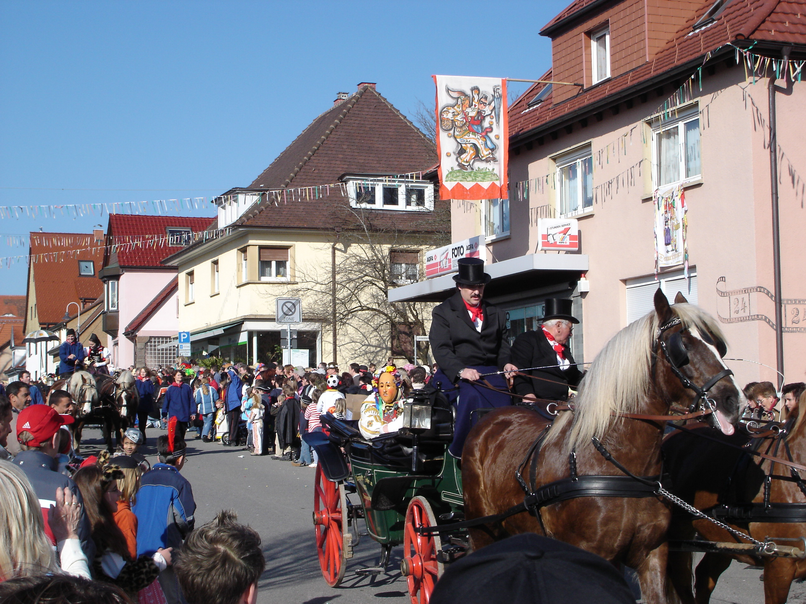

У каждого города, каждой деревни в округе есть свой собственный уникальный наряд для данного празднования. Вот так выглядят традиционные наряды нашего города:

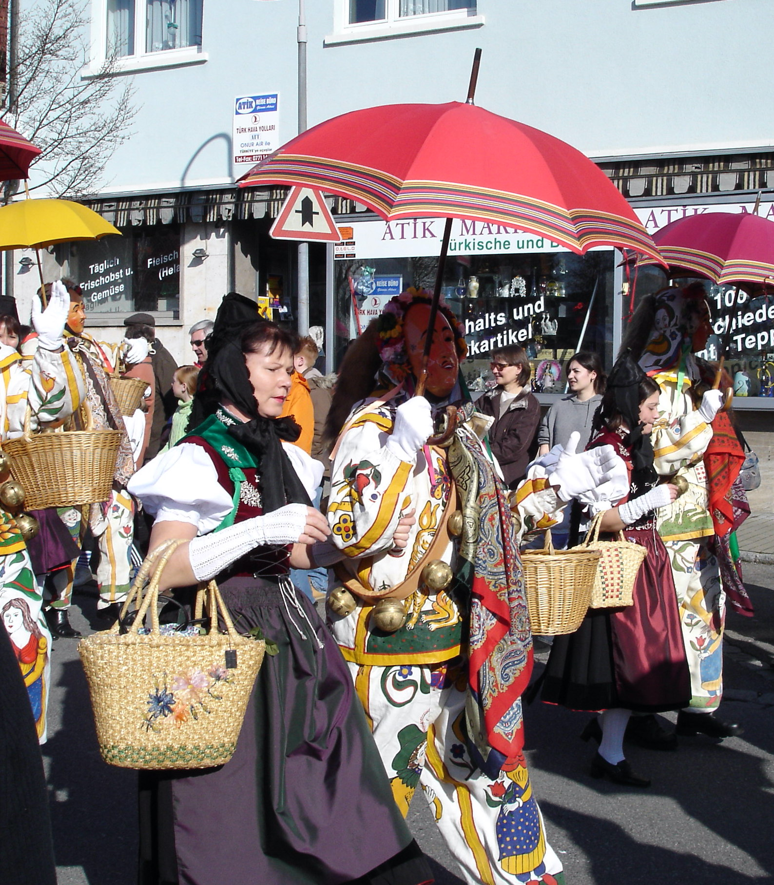

Шествия продолжаются, традиционные костюмы сменяются другим духовым оркестром:

Корзинки, которые несут с собой дамы, полны леденцов и сладостей, которые летят в толпу на счастье ребятишек. Те, в свою очередь тоже с корзинками, усердно ловят и подбирают добычу, складывают в корзинки и гордо демонстрирют родителям свои успехи:

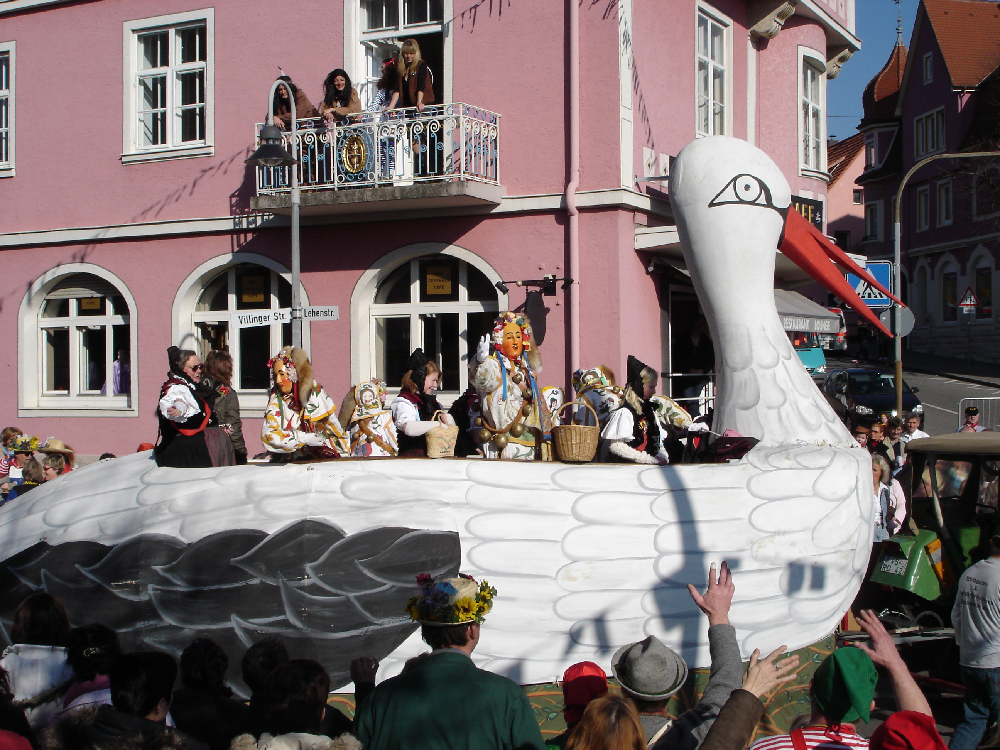

Дровосеки демострируют свои навыки в обращении с топорами:

Ну и какой же праздник без пива?

А без стриптиза? :)

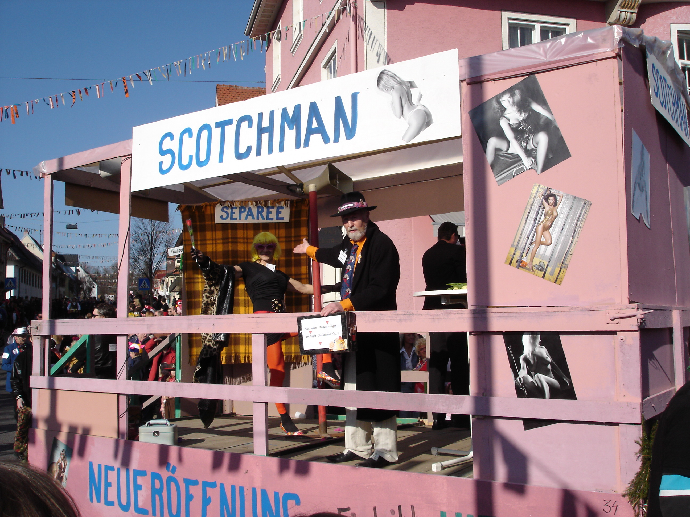

И тут, в самый разгар праздника, появились те, кого ждали меньше всего – представители незарегистрированного культа черной магии, а по просту ведьмы и лешие:

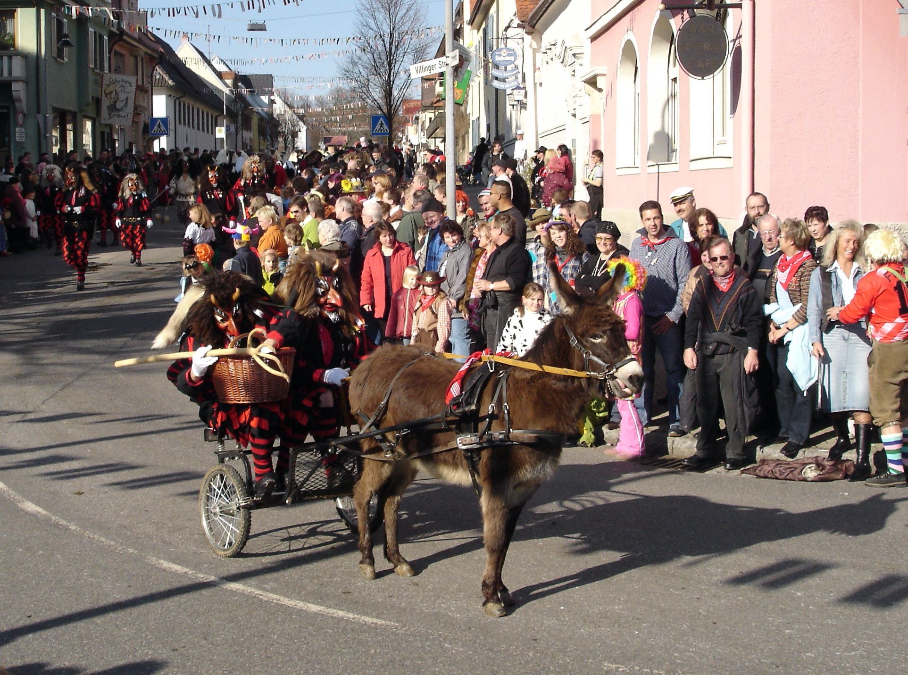

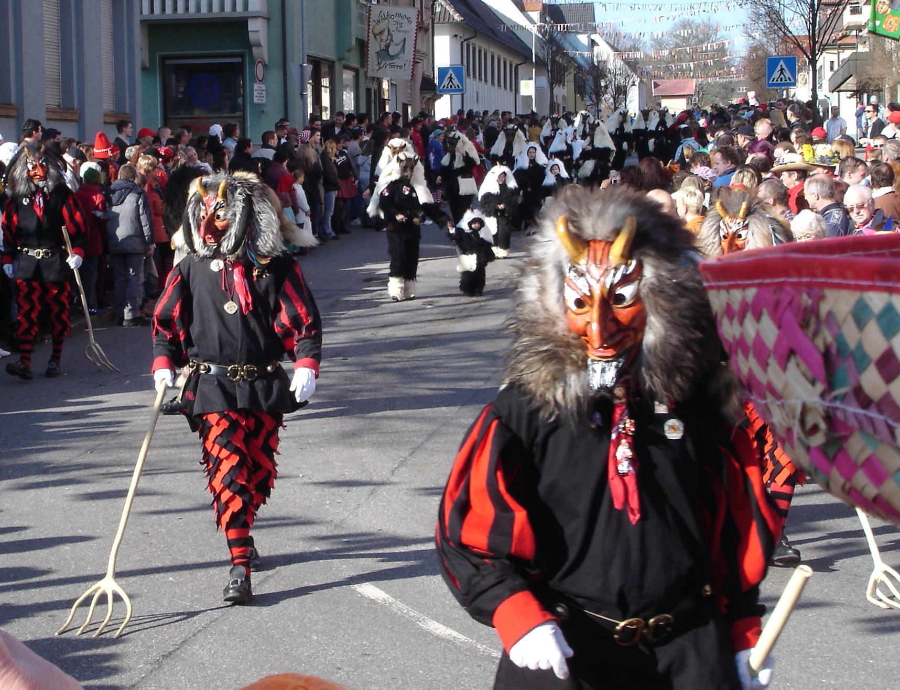

За ними по пятам, те Иванушки, что не слушали Аленушек:

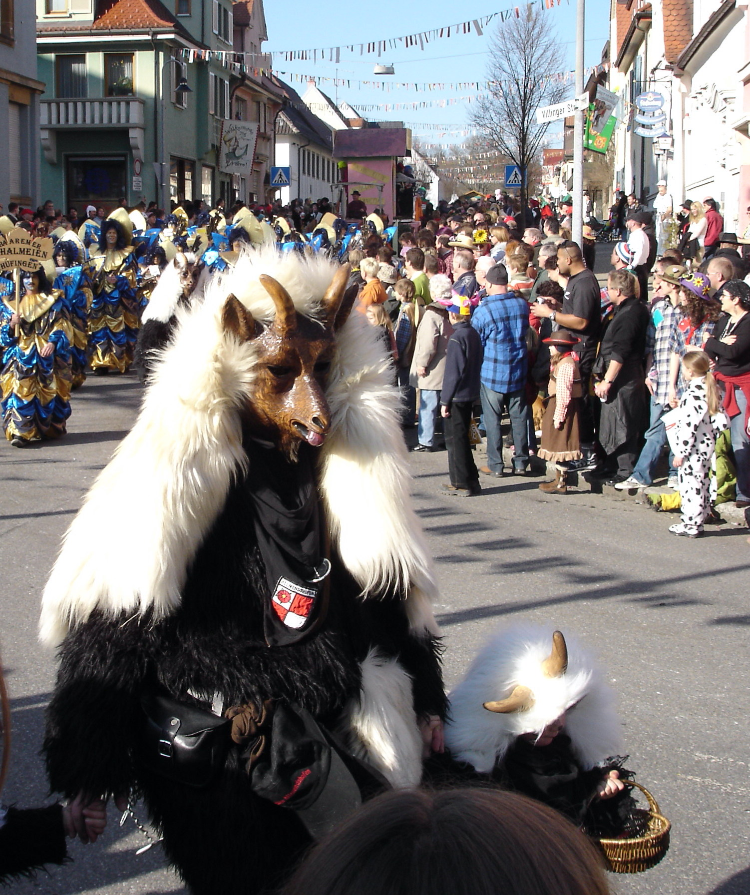

Представители в костюмах из соседнего селения:

Но кто бы мог ожидать такого подвоха от баба-ёжек? Напустив побольше дыму для маскировки:

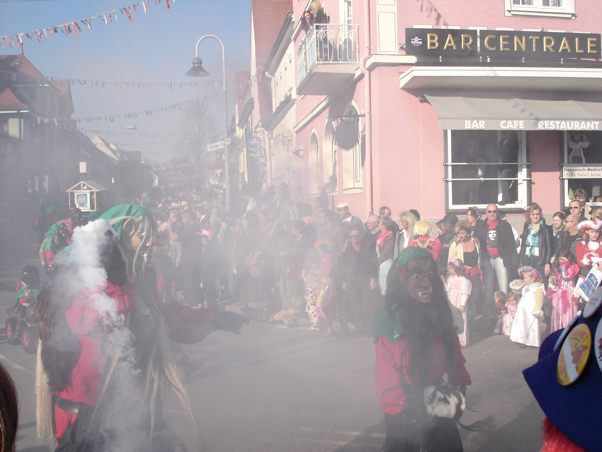

Они выходили в толпу на охоту за очередной жертвой:

Что стало в дальнейшем с теми несчастными девушками – никто не знает.
Зловещие гномы с трещалками:

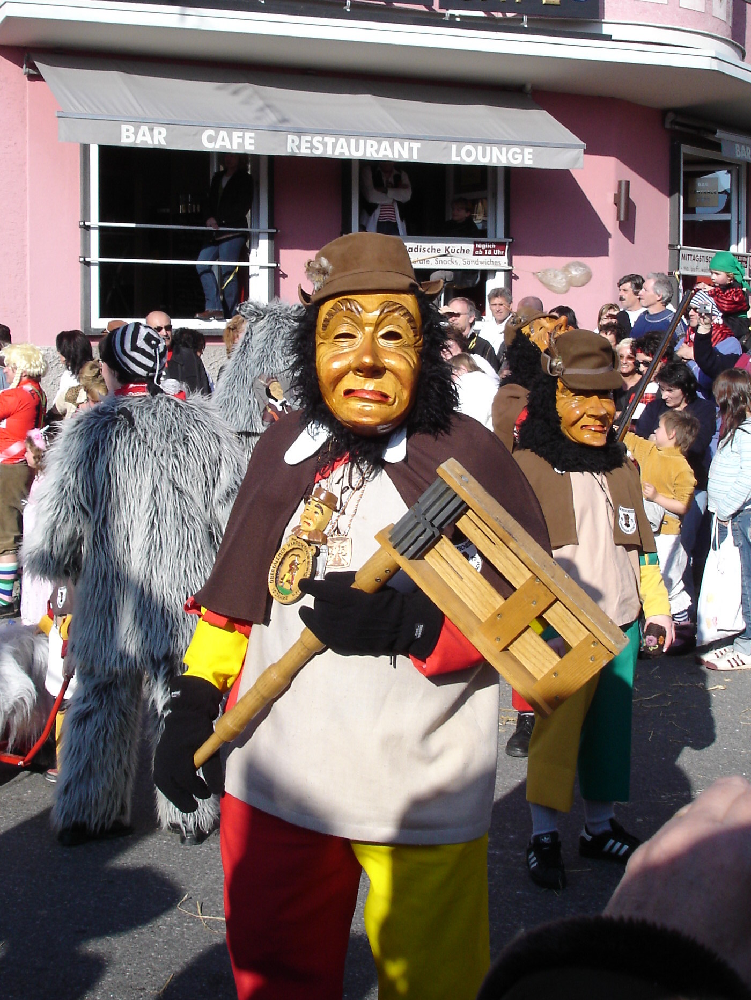

Самые настоящие бабки-ёжки из русских народных сказок:

Тролли, или кто там еще? Все промелькнули перед нами, все побывали тут. Смотря на следующих представителей мне почему-то вспомнилось аниме Spirited Away (Унесённые призраками):

Завершали шествие зловещие, но добродушные ведьмы с метлами, которые пытались хоть как-то навести порядок, подмести мусор – бесполезно :)

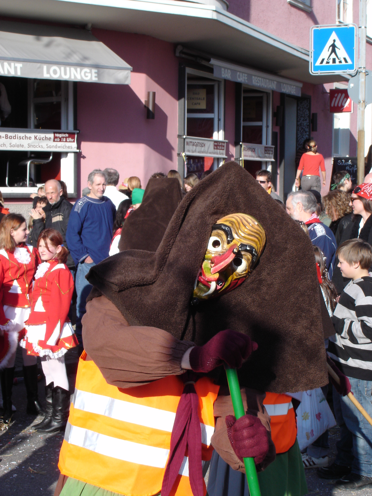

Ну и фасад ратуши, подтверждающий, что местные власти в союзе с нечистой силой, один раз в году полностью поддерживают такого рода беспорядки в нашем городке:

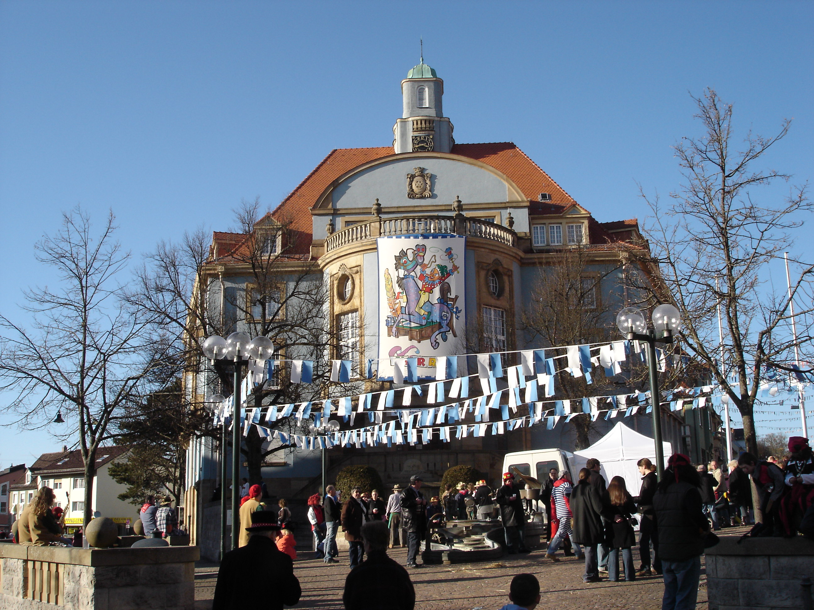

И еще, самые активные участники карнавала обычно берут на это время 2 недели отпуска и от города к городу, из селения в селение, следуют за карнавалом, который по рассписанию проходит в разные дни в различных городах. Завтра карнавал придет в город, где я работаю.
