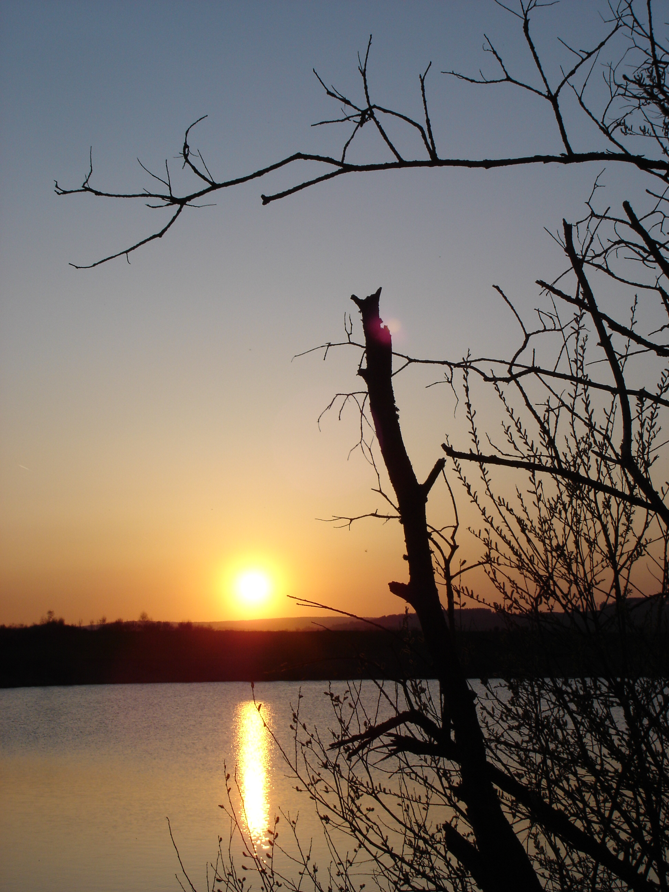

вчера и день до этого опять катался на роликах, но был уже умнее и каждый раз брал с собой фотоаппарат, пусть и почти мыльница, но фотоаппарат - это не мобила

вот такие у нас прерии:

в первый раз мне не повезло, и закат был через чур облачный, зато фотки получились как скрин-шоты из СТАЛКЕРа :)

Вчера мне повезло больше, получились вполне неплохие снимки заката, почти романтичного.. ^_^

Решил повторить фотографию с березой с предыдущего раза, с примерно того же ракурса, но теперь уже ярким диском заходящего солнца:

2 минуты до полного заката:

ну и это, типа попытался сообразить что-то на матрице соньки, скажем так "Размышления о вечном":

