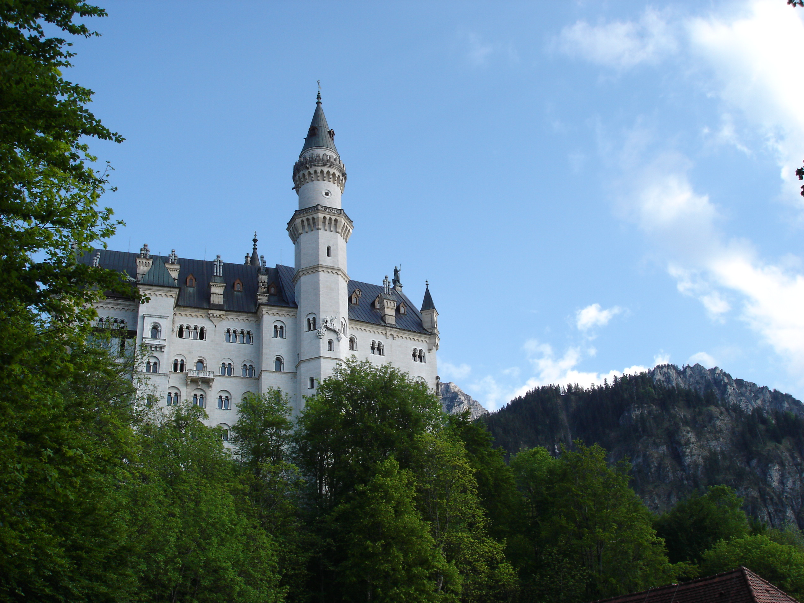
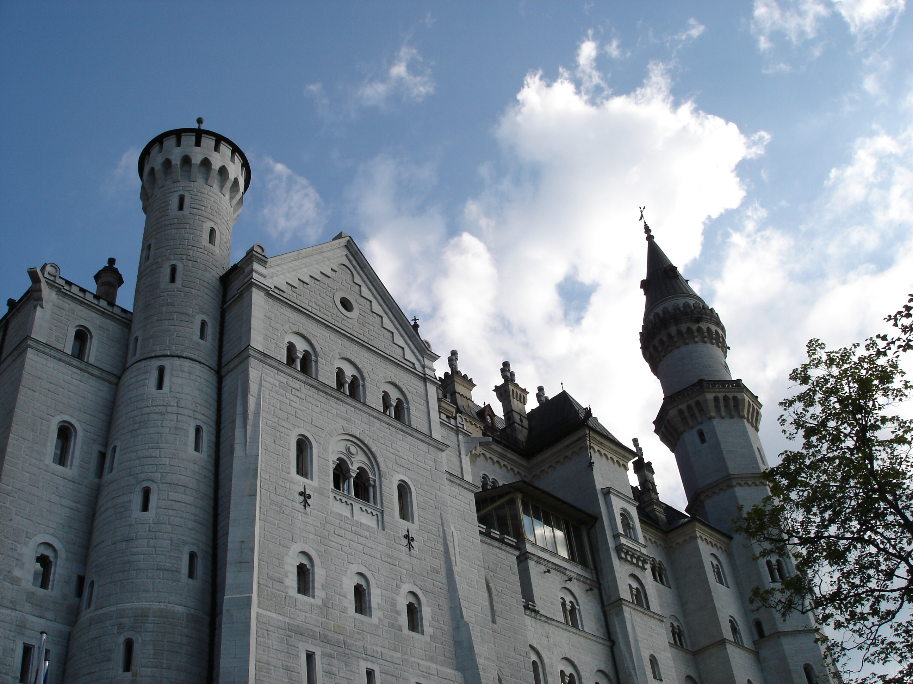
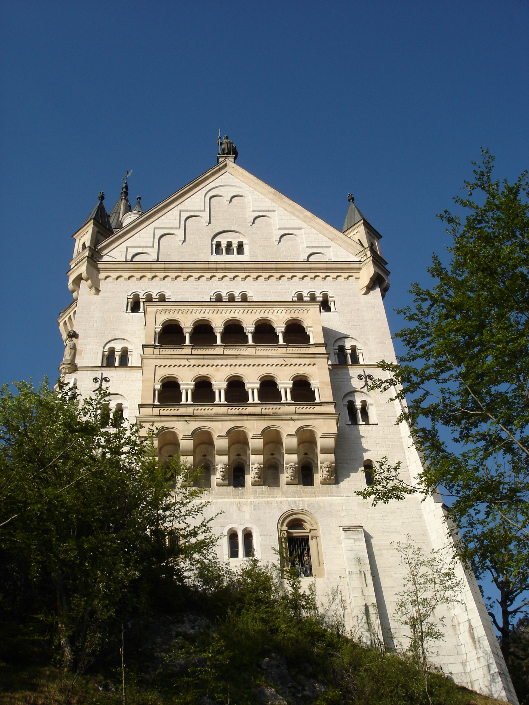
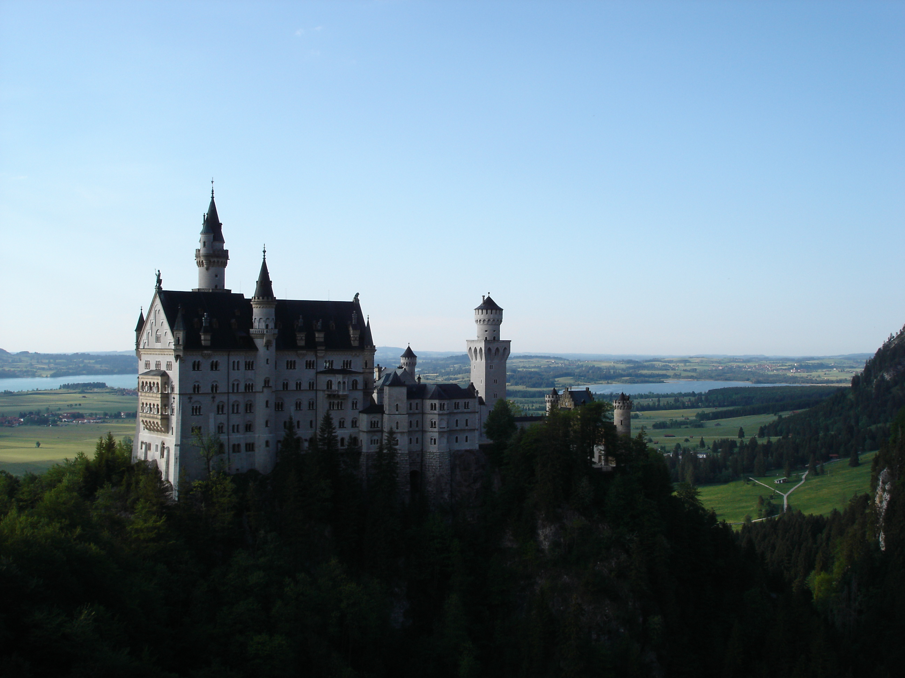
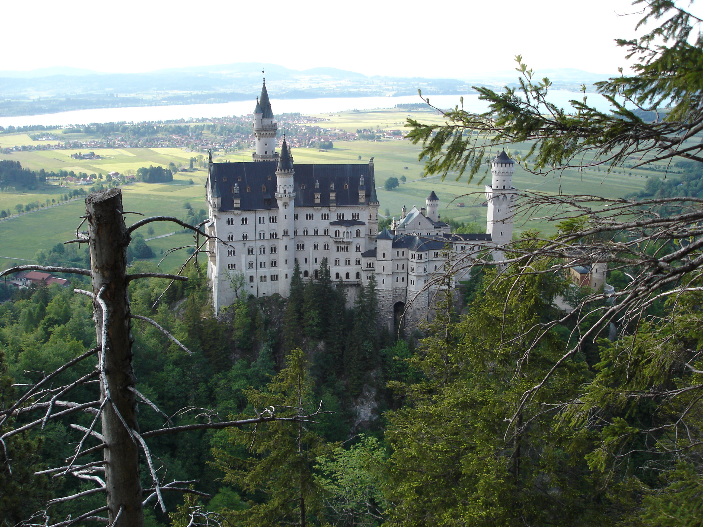
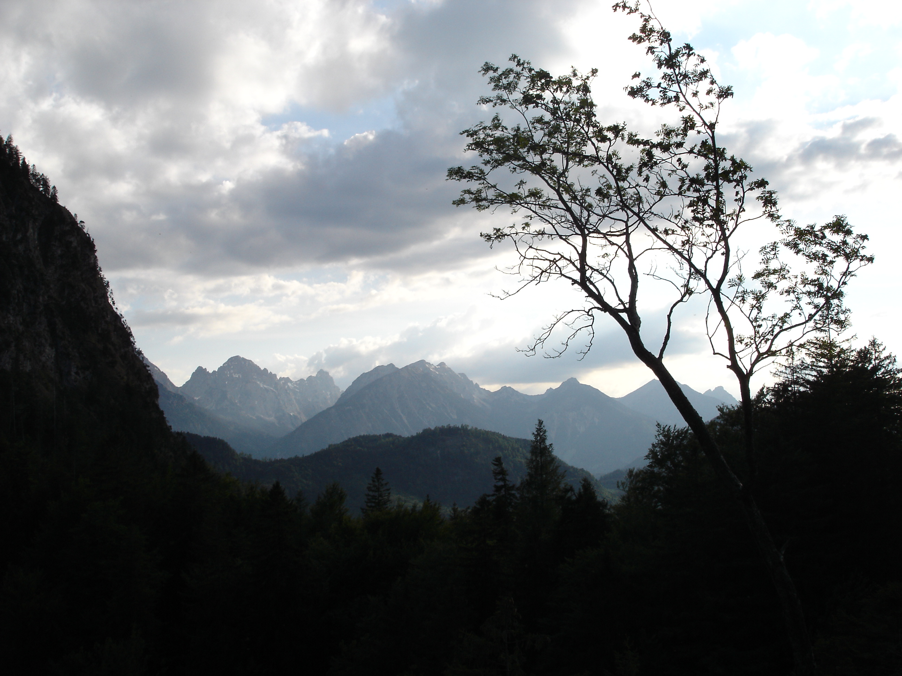

Намедни заезжал братик погостить, мы попутешествовали немного, ну и конечно грех было не посетить самые туристические места, те самые 3 места куда везут всех японцев, когда те совершают тур "галопом по Европам".

Вот, самое красивое и все же наверное самое известное из них:

Когда я посетил этот замок в первый раз, он произвел на меня колоссальное впечатление. За прошедшее время красота это замка нисколечки не изменилась, но, похоже, изменилось мое отношение к жизни.

Если бы я начал описывать белоснежность стен и красоту гор, что поразила мое воображение, я бы звучал фальшиво для самого себя. Поэтому замолкаю и просто продемонстрирую парочку других видов.

Вид из-под стен замка:

Далее мы двинулись в обход замка по горам, со стороны освещенной заходящим солнцем:

Вид на замок с узенького моста перекинутого через глубоченную пропасть в горах (было страшно смотреть вниз):

Потом мы долго-долго карабкались по узенькой горной тропинке для того, чтобы сфотографировать нечто такое:

Ну и другие романтичные виды:

Кстати, у замка очень поэтичное название, хоть и построен он был по заказу полу-сумасшедшего баварского короля.
