это не ослик ИА-а из знаменитой сказки, это Internationale Automobil-Ausstellung или, другими словами, Международная Автомобильная Выставка, которая на этот раз проходила во Франкфурте.

Это конечно не CeBIT, но тот уже давно наскучил, да и Франкфурт ближе как-никак. Короче, мы с Лешиком решили пренепременно посетить это знаменательное событие, чтобы получить определенное представление о том, какие машины нам придется наблюдать в ближайшем будущем на автобанах.

Судя по всему, темой выставки в этом году стала безвозмездная любовь к природе и защита окружающей среды, так как буквально все ведущие производители автомобилей мира выставляли автомобили с гибридными двегателями и другого рода экологически чистыми технологиями, а также соревновались в показателях потребления топлива и выбросе углекислого газа: кто меньше. Но об этом позже, а сейчас по порядку.

Сразу скажу, что обойти всю площадь выставки нам не удалось, кроме того сфотографировать многие из интересных моделей было просто физически невозможно, но кое-чего все таки удалось.

Свой осмотр мы начали с зала 3.1 (второй этаж), где выставлялись Volvo, Suzuki, Nissan, Renault, Mazda, Ford и несколько других компаний. На входе нас встретили джипы от Land Rover, но наше внимание быстро переключилось на существующие модели знаменитой шведской марки, а также на их концепт-модель джипа будущего:

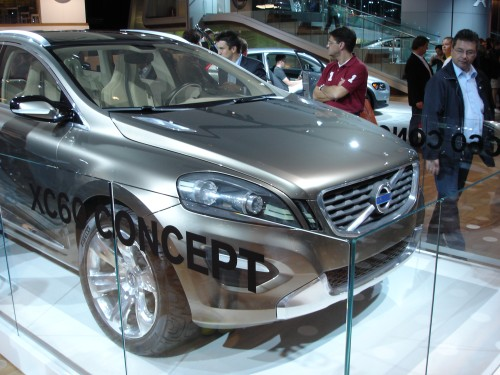

Вот такой могла бы выглядеть следующая машина Джемса Бонда, если бы он не изменил своим вкусам и не пересел сначала на BMW, а затем и вообще на Ford. Aston Martin вашему вниманию:

Следующая модель от Renault привлекла мое внимание своим оригинальным дизайном удобным для, как полагают его дизайнеры, смены обуви на роликовые коньки, кроме того яркий оранжевый цвет выгодно выделял данную модель среди многих других с более скромной расцветкой. Вашему вниманию вид сзади на горбатенький Kangoo симпатичной расцветки:

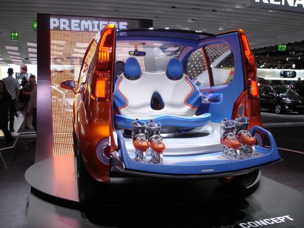

Обратите внимание на возможность разворота задних сидений таким образом, чтобы можно было свободно одеть ролики сидя в удобных креслах. Вообще, возможности поворота кресел на 180° была представлена на выставке в нескольких моделях разных фирм.

Вот так "скромно, но со вкусом" видит свой будущий джип Ford, вашему вниманию Kuga, насколько удачно мне удалось ее сфотографировать:

Джипы на выставке были представлены в огромном разнообразии, кроме того активно велась рекламная компания ведущими автомобилестроителями, куча кноцепт-моделей, все модели с новыми супер-экологическичистыми двигателями... Либо это тенденция, либо все это не спроста.

В уголоке Nissan демонстрировалась концепт-модель электромобиля будущего Mixim. Занимательная панель управления:

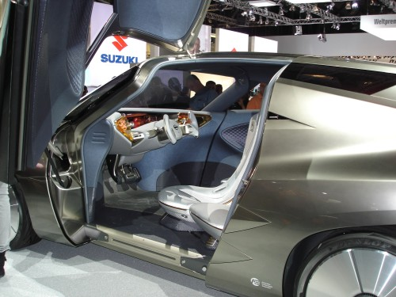

Оригинальное расположение кресел – 3 кресла, сиденье водителя по середине:

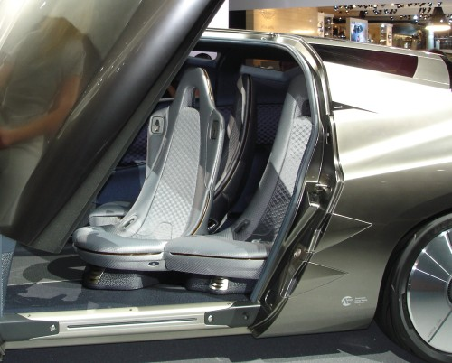

Сложно сказать, будет ли воплощен данный дизайн в серийной модели, если это вообще когда-нибудь дойдет до серийного производства, так как трудно поверить, что такой необычный дизайн увеличит спрос на автомобиль, но, стоит им отдать должное, это достаточно смелая попытка.

Далее мы спустились этажом ниже в зал 3.0, где выставлялись модели концерна VW: Audi, Skoda, Seat, ну и конечно же сам VW. Вот тут мы впервые ощутили, что IAA пользуется популярностью и посетителей намного больше чем нам показалось вначале. Ни одной Audi мне не удалось сфотографировать вообще :( хотя несколько моделей были очень даже ничего, но, по-моему ничего особо нового и революционного представлено не было, будущие модели уже известных и заслуживших свою популярность серий.

Если площадь, отведенная для Audi занимала где-то четверть ангара, то добрая половина была отведена под автомобили марки VW и их новое направление: голубое движение, в смысле технологии направленные на защиту окружающей среды - Blue Motion. Множество уже зарекомендовавших себя моделей теперь уже с двигателями нового поколения, стенды, объясняющие принцыпы новых технологий, красивое шоу с летающими девушками выполняющими акробатические фигуры. В общем и целом VW оставил очень хорошее впечатление, но...

Как я уже упоминал выше, в этом году модно выставлять джипы. VW представил свою новую модель Tiguan, которая, насколько мне известно, уже запущена в серийное производство:

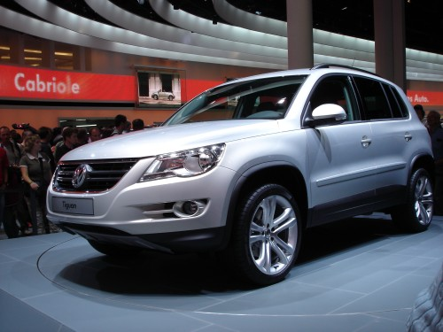

Ну зачем, зачем они так изуродовали нос бедного джипа? Ему все равно не ездить по болотам...

Даже вот эта двухместная модель мини-джипа, представленная Seat'ом, выглядит намного симпатичнее:

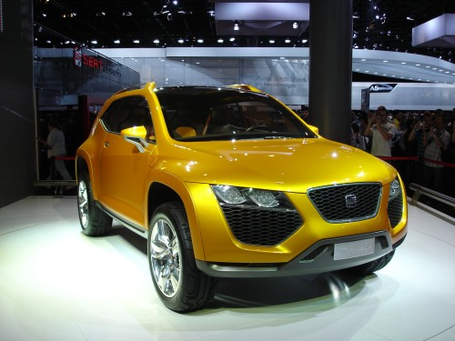

В самом центре выставки разместился индивидуальный ангар, всецело и полностью отведенный под автомобили BMW. Потоки входа и выхода строго контролировались обслуживающим персоналом. Зайдя через главный вход и поднявшись на второй этаж, откуда по мнению организаторов ангара должен был начинаться осмотр выставки BMW мы в общем-то поняли для чего были необходимы данные ухищрения:

Фишкой BMW в этом году... как вы уже наверное догадались, стал прототип будущего джипа X6:

Несомненно, другие модели BMW, представленные на выставке, также заслуживают своего внимания, но джип своим великолепием затмил все другие впечатления. По-моему скромному мнению, BMW представила лучший джип из всех виденных мною на IAA. Вот он, красавец, при ближайшем рассмотрении:

Конечно же с двигателем будущего поколения, голубые технологии, любовь к природе и все такое – все это также при нем.

Далее мы отправились посмотреть на модели третьего гиганта немецкой автомобильной промышленности – Mercedes, индивидуальный ангар которого был не меньше, если не больше ангара отведенного для BMW. Наряду с разнообразными автомобилями бизнес-класса были обширно представлены двухместные спортивные автомобили уже как уже существующих моделей, так и моделей, выпуск которых начнется в скором времени (цены от 80-100 и выше в базовой комплекции "без наворотов"):

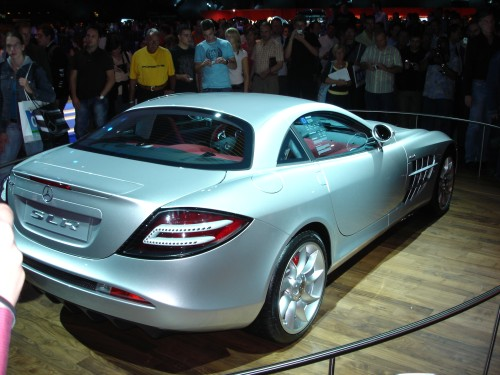

Особое место в ангаре Mercedes, привлекающее наибольшее число посетителей, занимала концепт-модель будущего... нет не джипа :) но экологически-продвинутого автомобиля F700.

Оригинальный, хотя и не новаторский, дизайн дверей отлично вписывается в стилизованные формы автомобиля, возможность разворачивать задние сиденья на 180°, встроенные мониторы для пассажиров сзади:

И все это с двигателем потребляющим 5.3 л / 100 км и выбрасывающим 127 г CO2 / км – Mercedes идет в ногу с эпохой и тоже заботиться об окружающей среде. Вот так, возможно, будут выглядет такси в Германии через 4-7 лет:

Если честно, то я не верю, что производители автомобилей действительно так сильно заботятся о природе. Автомобилестроение – это жестокий бизнес и работает он по законам спрос/предложение. Просто, в связи с существующими прогнозами на неуклонный рост цен на нефть и нефтепродукты, а также новый свод законов, вводимых в рамках Европейского Содружества, автомобили, потребляющие меньше топлива и выбрасывающие меньше вредных веществ в окружающую среду, стали "неожиданно" популярными и главное МОДНЫМИ. Именно так, это новая мода. И я рад, что данная крупные корпорации поддерживают и развивают моду, которая положительно отражается на состоянии окружающей среды.

А вот и модный джип от Mercedes с гибридным двигателем:

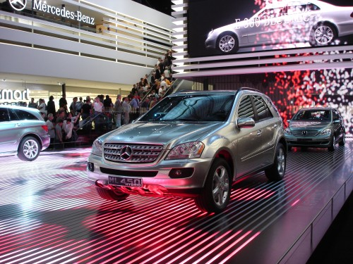

Не уверен, насколько "моден" данный кабриолет, но выглядит очень симпатично:

Для тех, кто устал рассматривать этот серпантин из новых/будущих автомобилей, предлагаю немного отвлечься и взглянуть на интересную разработку для полицейских в многонаселенных городах, где необходимость мобильности и скорости передвижения совмещается с необходимостью маневренности и возможности передвигаться там, где обычный автомобиль не проедет.

Вот такой вот электро-самокат демонстрировался всем прохожим и дружелбный полицеский объяснял его возможности и преимущества, насколько мне известно, данная модель уже внедрена в производство и используется в ряде городов Германии:

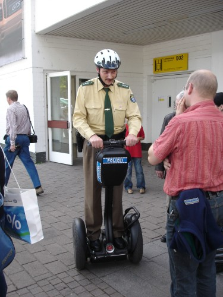

В следующем ангаре Porsche удивляла всех посититей, тем что отошла от своих канонов в расскраске автомобилей:

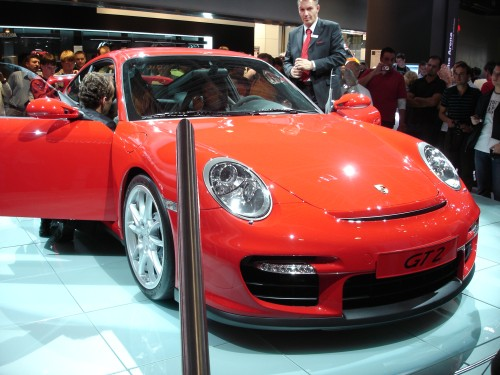

Кроме того, Porsche также представляла... джип :) но толпы посетителей не позволилил получить удачной фотографии данного чуда.

К данному моменту мы уже порядком утомились, к тому же подходило время возвращаться назад, но один ангар, а точнее одну из компаний, представленных в данном ангаре мы просто не могли пройти стороной.

Эм... даже не знаю как и начать. Закат отечественного автомобилестроения или быть может... величайшее разочарование года... в общем, мы пошли смотреть модели автомобилей Lada. И вот что мы там обнаружили:

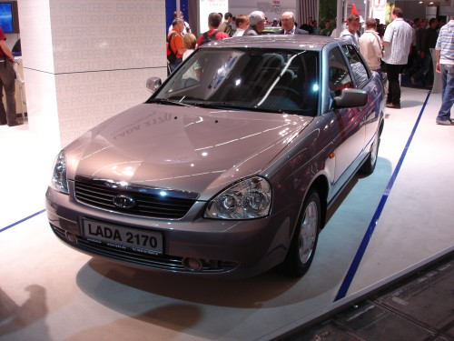

Надпись на номере следующей модели гласит "LADA.. .....правильный выбор":

В тех многоточиях спрятано мнооооого смысла.

Еще одна "Lada - Супер", раскрашенная под матрешку:

Сказать "разочарованные" – не сказать ничего, неудивительно, что возле данного стенда у меня не было проблем сделать данные фотографии. Редкие посетители, разговаривающие по-русски, забредали в данную часть зала, но долго тут не задерживались.

Поймите меня правильно, я не хочу говорить ничего плохого об отечественных автомобилях и их качестве, но... это же... это же дизайн даже не 20-ти, - 30-ти летней давности.

Наряду с Ладой в ангаре выставлялись и другие "малоизвестные компании". Взгляните хотя бы на китайский Ssang Yong:

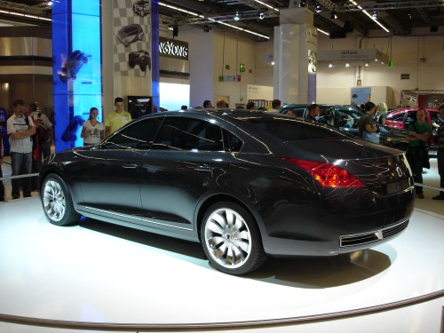

Тут же KIA, шагая в ногу с эпохой, представиляла свой вариант эко-автомобиля с выбросами 102 г CO2 на км:

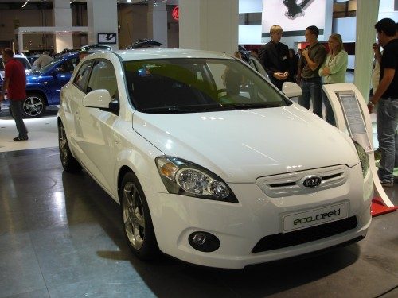

Мы постарались как можно быстрее покинуть этот ангар и я убедил Лешика напоследок отправиться и взглянуть на итальянские автомобили – отрада для души :) Присутствующая масса посетителей недвусмысленно подчеркивала популярность итальянских моделей среди народа и, к сожалению, ужасно затрудняла процесс фотографирования.

Удвивила необычной расскраской Ferrary:

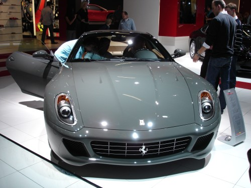

Подиум, где демострировалось будующее основной линейки моделей Ferrary, был огорожен и туда запускали и выпускали строго в порядке очереди. Мы печально взглянули на толпу и решили, что не в этот раз :(

Вот еще одна модель необычной, но очень симпатичной окраски, которую мне удалось сфотографировать:

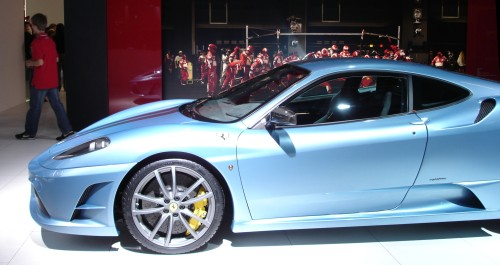

Ну и напоследок, автомобильчик, который я присмотрел для себя ;)

На этом я заканчиваю данный экскурс – быстрый и, несомненно, неполный обзор впечатлений с IAA 2007

В заключении хочу лишь добавить, что, несмотря на огромное количество действительно классных автомобилей, увиденных нами на выставке, я все еще пока доволен своей собственной машинкой ^_^
