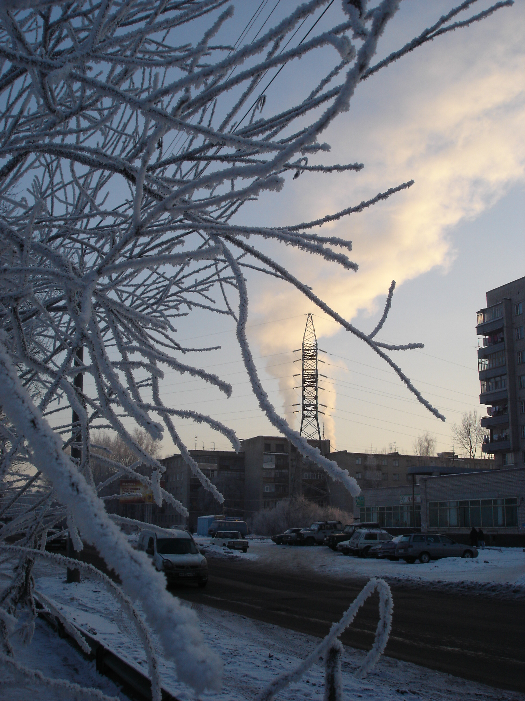
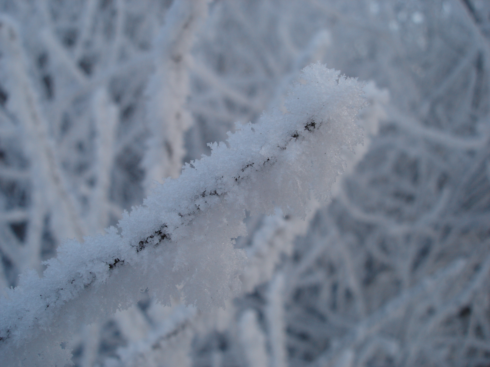
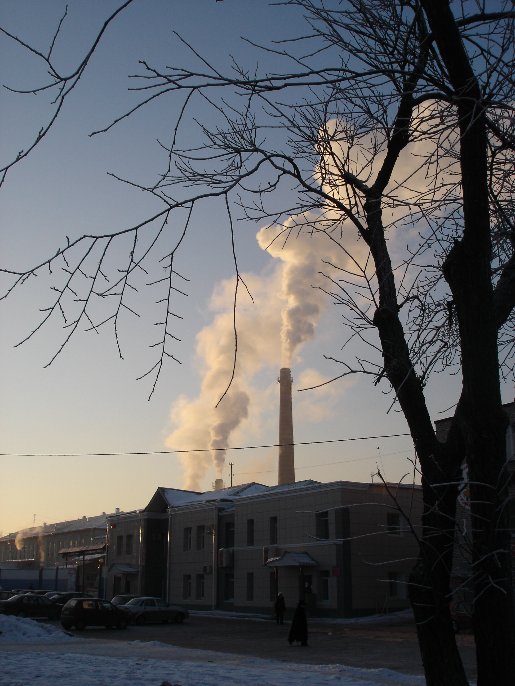
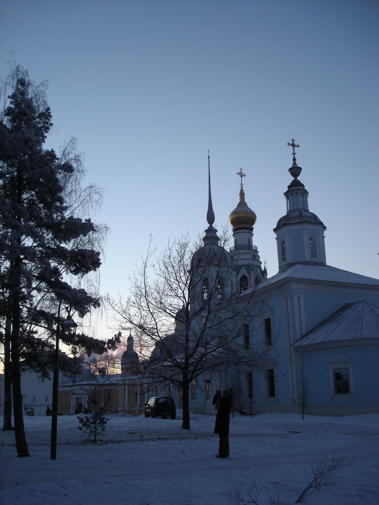
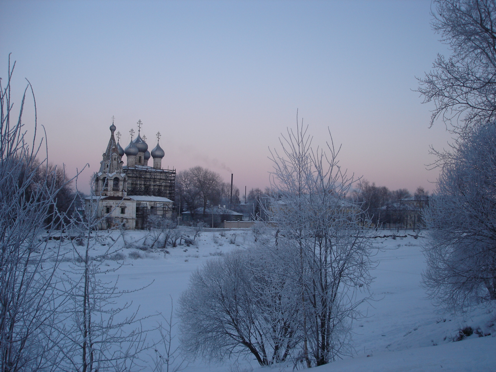
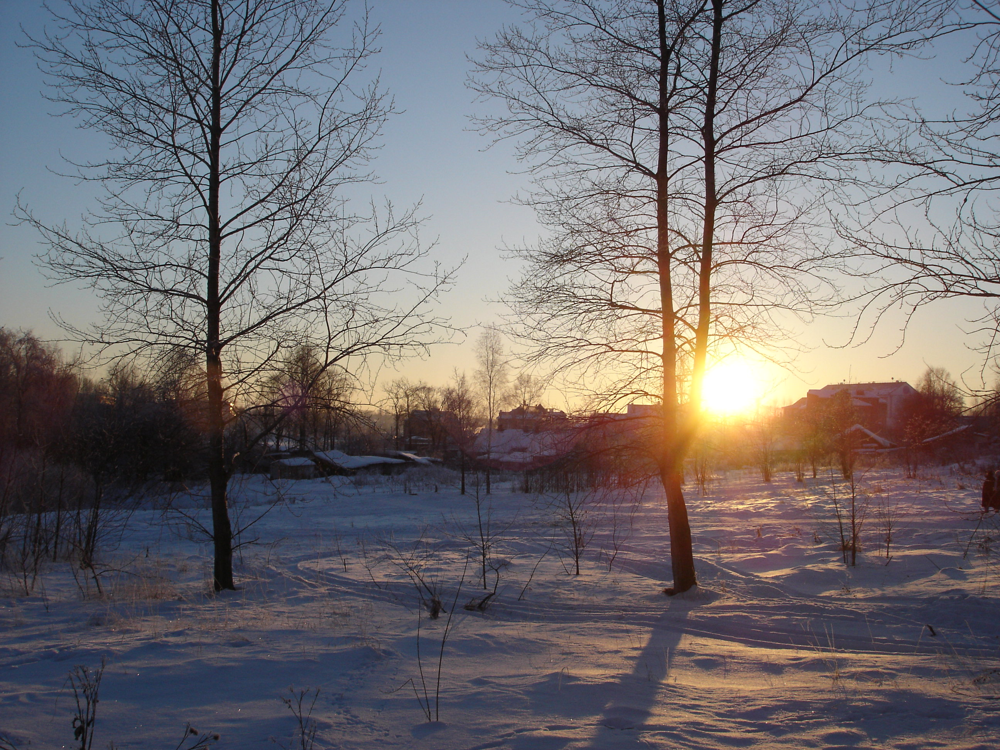
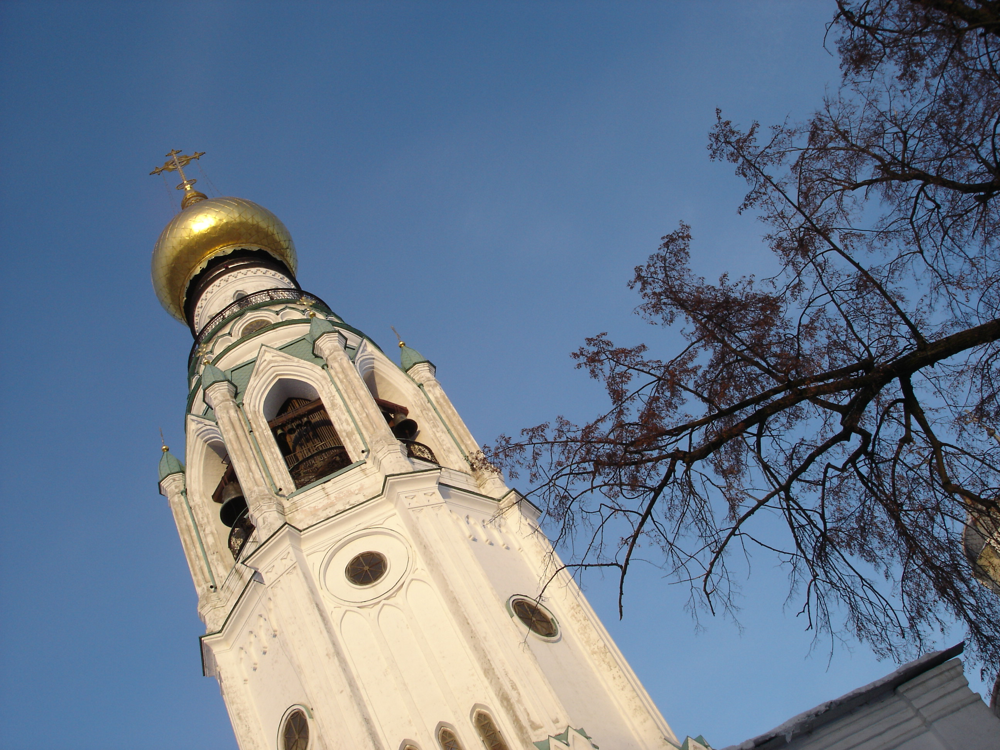
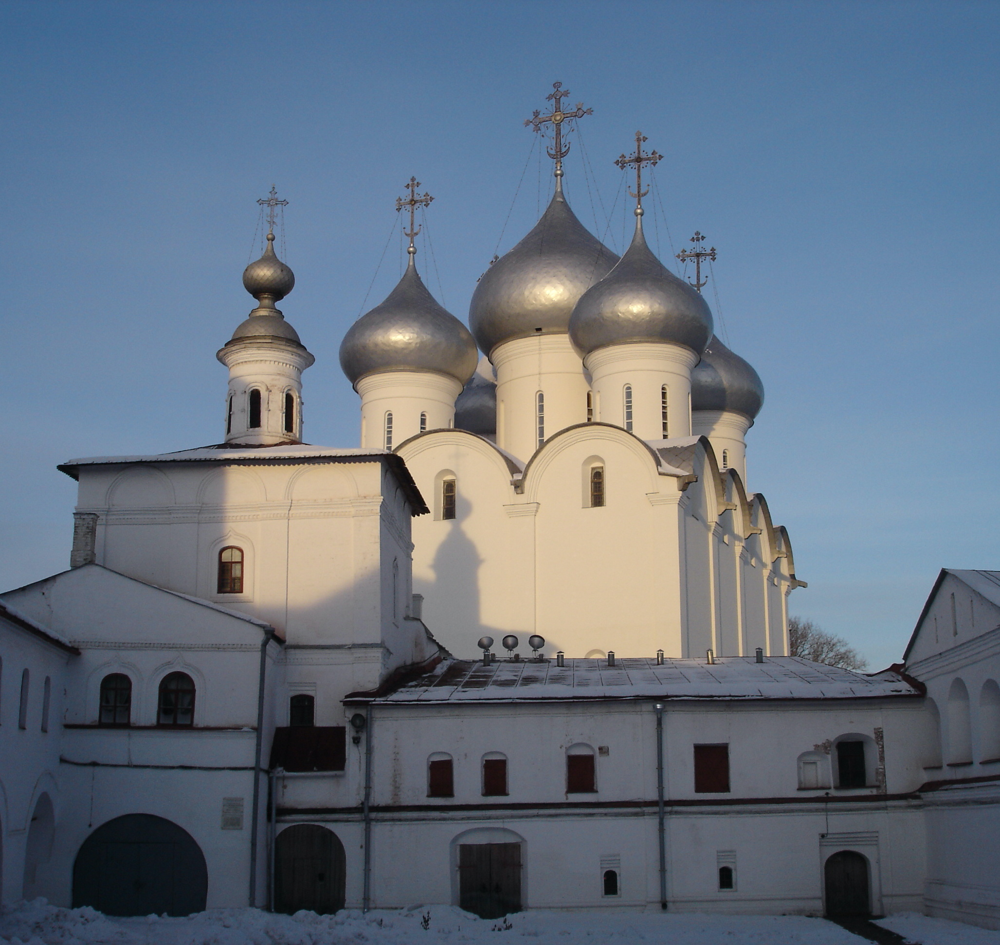

Даже не знаю, нужно ли давать какие-либо комментарии к фотографиям, некоторые утверждают, что это Вологда - это неинтересная тема, тем не менее выкладываю то, что мне показалось интересным настолько, что я, переборов нежелание мерзнуть, все же снимал перчатки доставал фотик и фотографировал:

попытки макросъемки, по-моему провалились:

низкое солнце создает очень красивое освещение для ледяных дорожек:

и снова трубы и дым:

первый раз когда я пошел делать фотографии визитной карточки города, я опоздал - солнце уже ушло за горизонт:

зимний пейзаж:

я повторил попытку на другой день и попал вовремя :)

