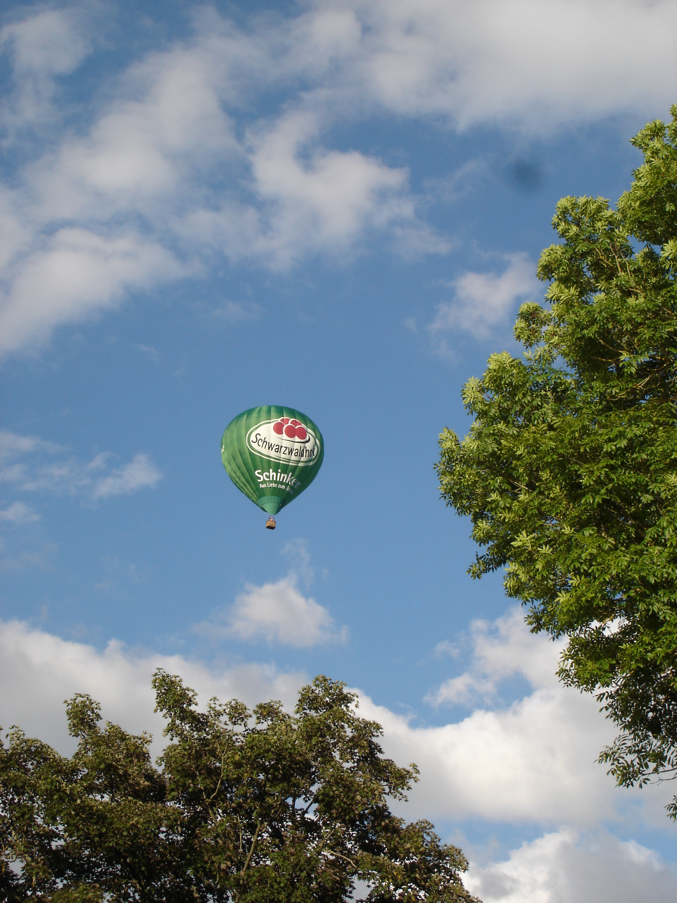
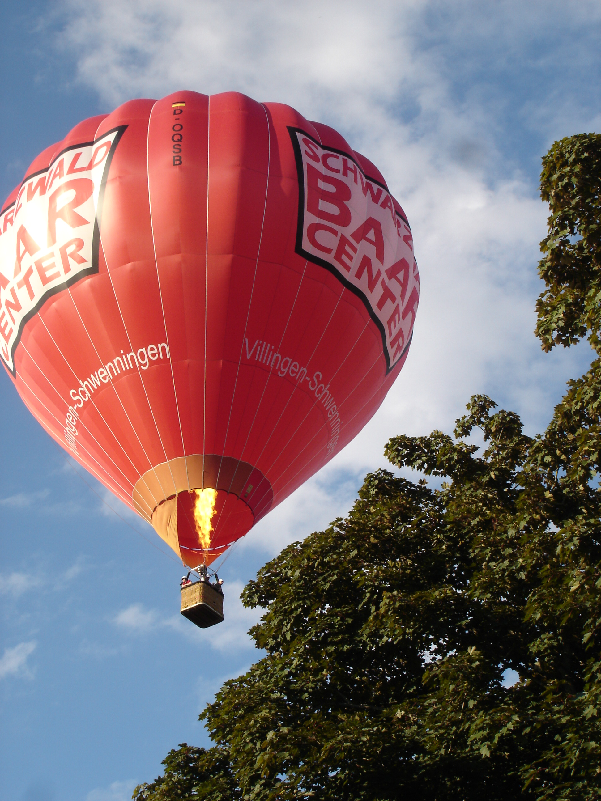

Каждое лето, особенно в солнечные деньки, обычно в выходные, нередко можно увидеть в небе вот такие вот летательные аппараты:

Запечатлев зеленый шарик, пролетавший невдалеке, я уже собрался было убрать фотик, как, развернувшись заметил еще один аппарат, почти цепляющие макушки деревьев:

Пилоту пришлось поддать газу:

После этого шарик и его пассажиры умчались в далекое лазурное небо:

