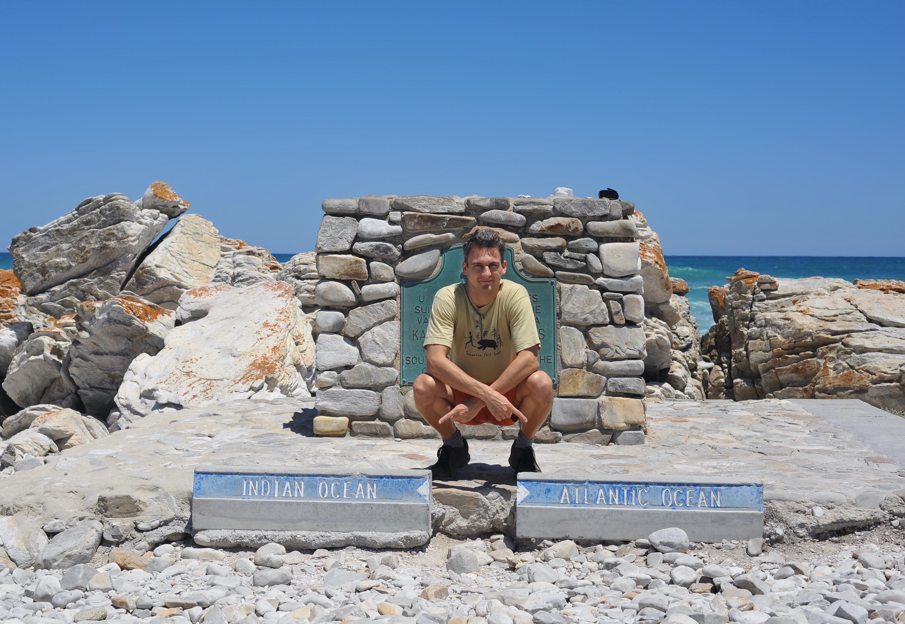
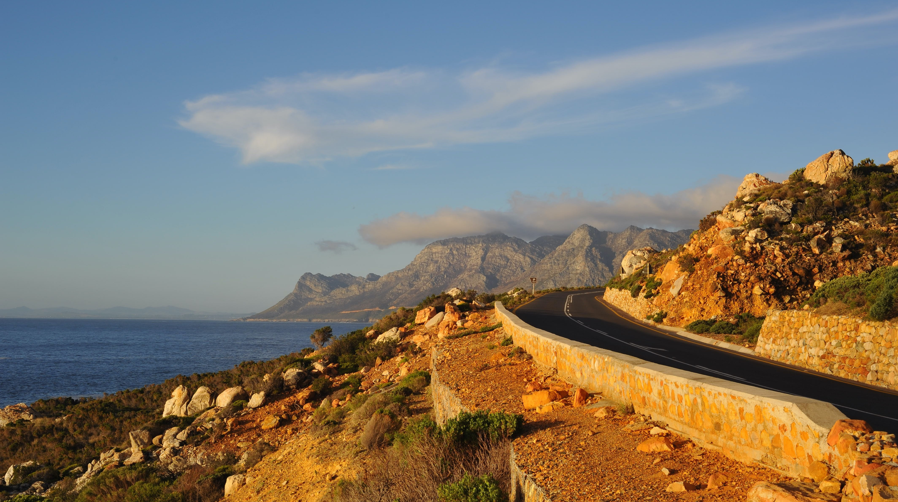
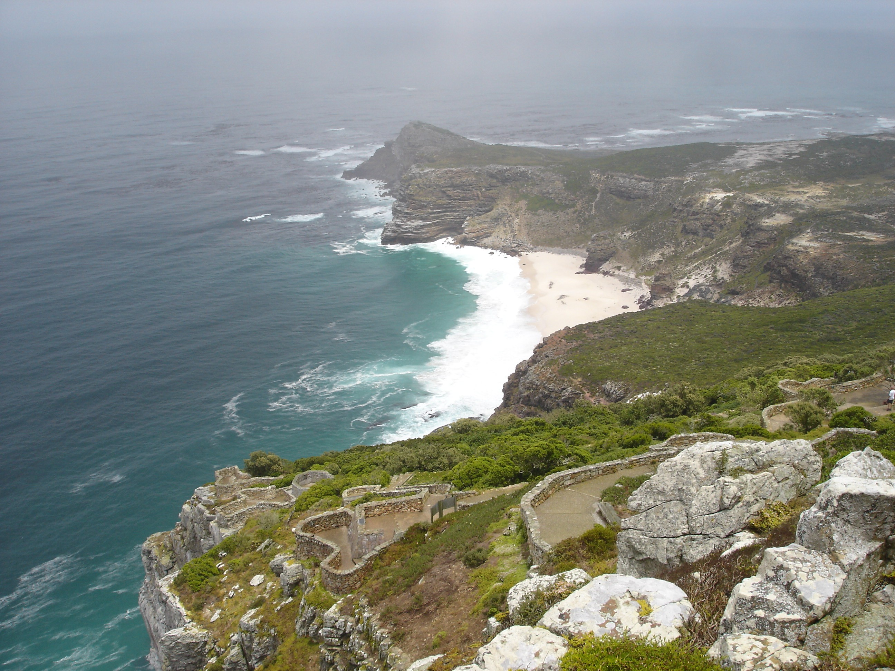
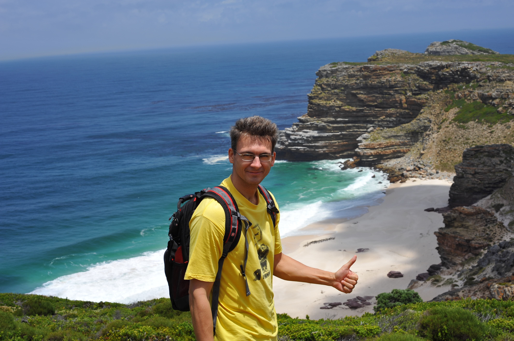
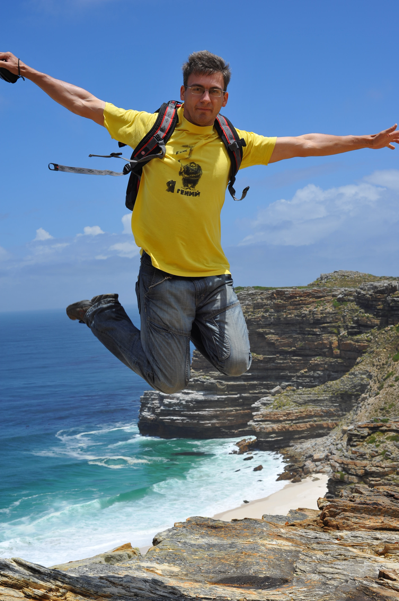
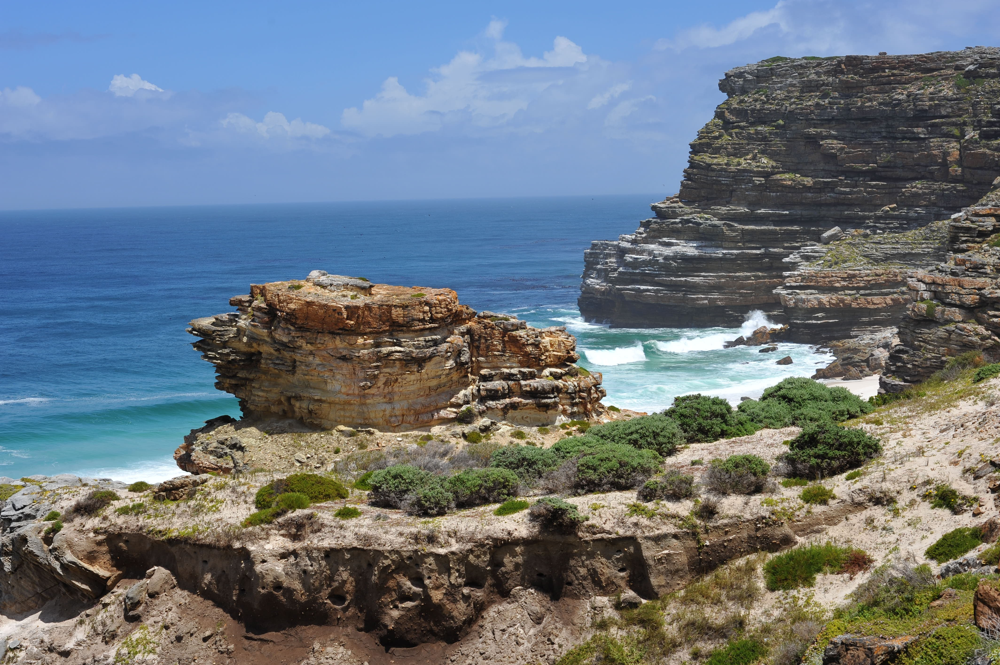
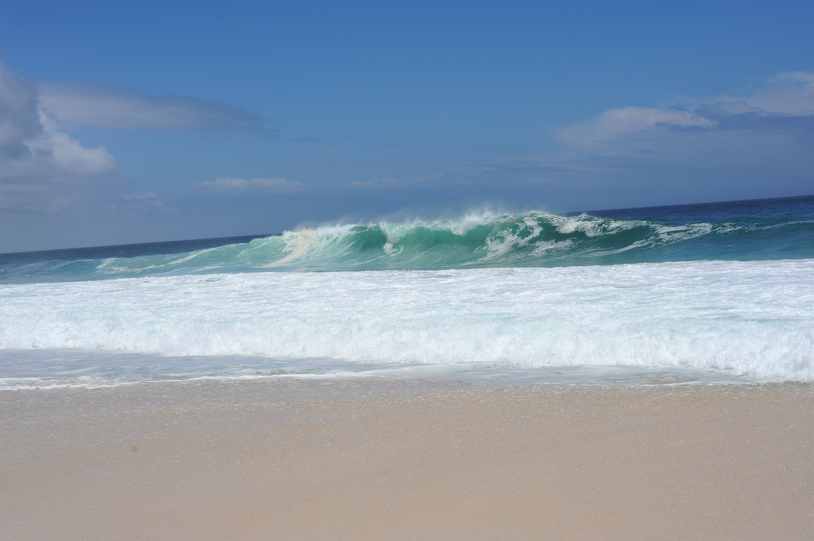
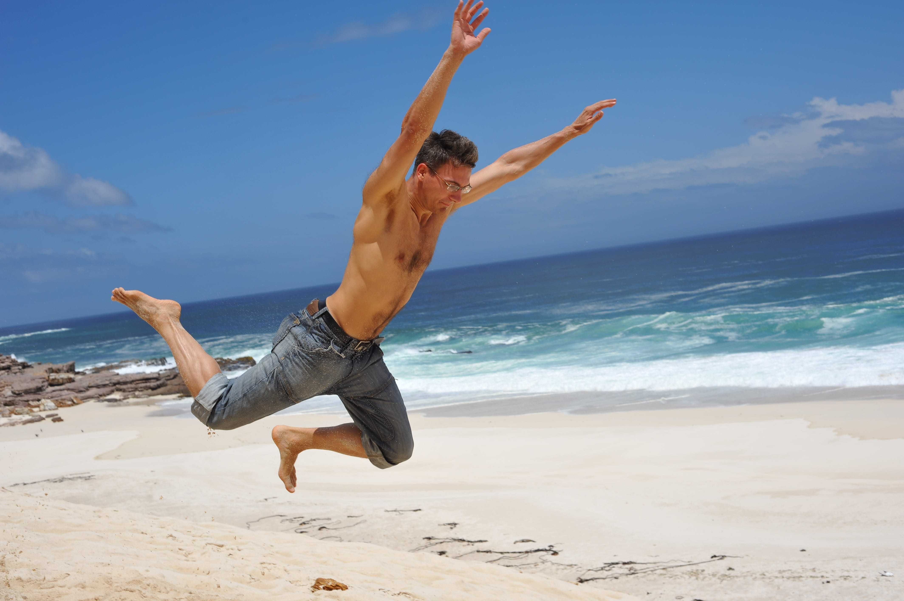
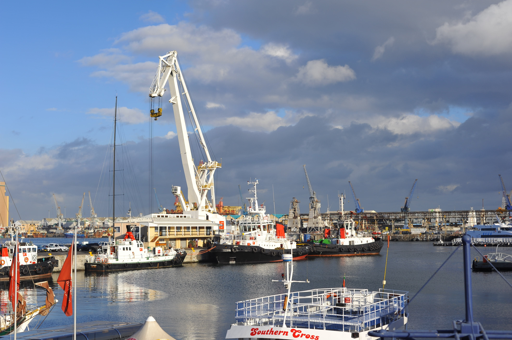

На сей раз занесла меня нелегкая, то бишь работа, в один из самых южных уголков нашего глобуса - в ЮАР, в окресности славного города Кейптауна. А там-то сейчас лето вовсю и подготовка к Рождеству в купальниках :)

Но, как сказал один из наших южно-африканских коллег: first things first, поэтому, несмотря на лето и курортные настроения, пришлось работать.

Однако в выходные мы таки вырвались из промороженных кондиционерами офисов и отправились на побережье 2-х океанов, чтобы зафиксировать там свое присутствие:

Искупавшись в Индийском океане нашли его достаточно теплым и отпавились по дороге вдоль побережья в сторону Атлантического океана. Нашему взору открывались сказочные прибрежные ландшафты, прибрежные скалы омываемые волнами Индийского и Атлантического океанов. Временами мы останавливались чтобы пофотографировать окружающую нас красоту.

На одной из остановок познакомились с группой охотников за китами - в это время южные киты подходят очень близко к побережью, наши друзья утверждали, что они видели фонтаны брызг одного из китов. Мы после этого, как ни вглядывались в даль океана так никаких китов и не увидели, что, впрочем, нисколько не умаляло красоту местных ландшафтов:

На следующий день у нас по плану был знаменитый мыс Доброй Надежды, но погода немного подкачала и поначалу мыс выглядел очень мрачно:

Мы уж было расстроились, потому как начал накрапывать дождик переходящий потихоньку в ливень, но тучки чудесным образом унесло атлантическим ветром и выглянуло солнышко:

Мы даже запрыгали на радостях :)

К сожалению, возможности ресурса не позволяют продемонстрировать всю красоту прибрежных пейзажей и атлантического океана, фотографии нужно рассматривать в полный экран на черном фоне, но выглядит это примерно так. Скальные прибрежные нагромождения:

Пляж:

Моя попытка полететь, закончилась, как и следовало того ожидать, неудачно, в песке :)

Напоследок мы заехали в Кейптаун, вот так выглядит местный порт:

Не стану утверждать что тема самой южной африканской страны раскрыта полностью, но так примерно выглядели наши выходные, а на неделе мы по большей части работали. Но, судя по всему, это мое не последнее путешествие в эту интересную "страну полную контрастов". Поэтому есть шанс, что здесь появятся более интересные рассказы о Южной Африке, может сафари... ^_^ эх.. мечты..

На сем спешу откланятся, и, ах да, всех с наступающим Католическим Рождеством! :)
